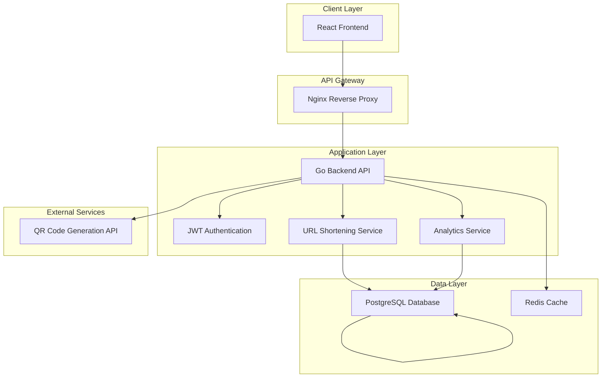
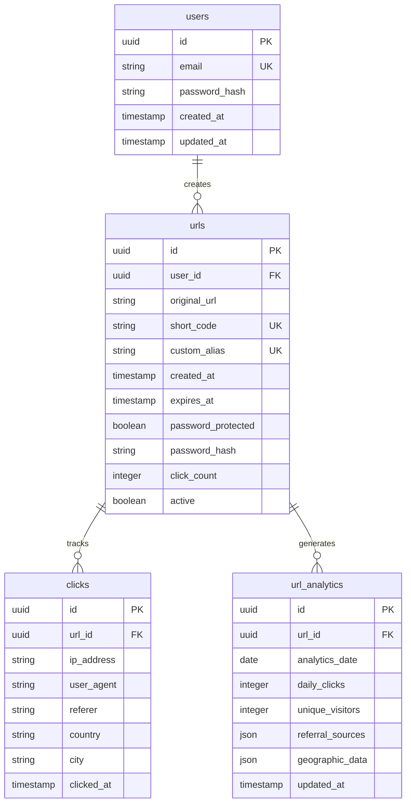
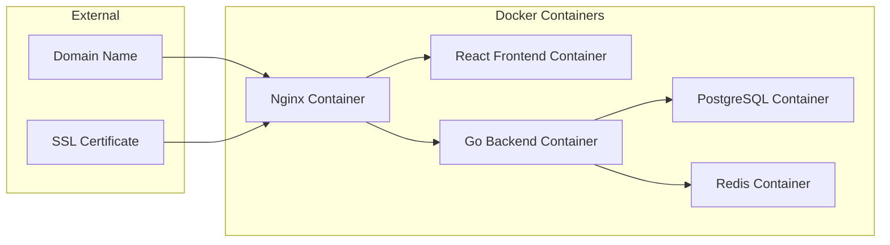

# URL Shortening Service Architecture

## System Overview

This URL shortening service consists of a React frontend, Go backend API, and PostgreSQL database, all containerized with Docker for easy deployment.

## Architecture Diagram

## Database Schema

## Technology Stack

### Frontend
- React 18 with TypeScript
- Tailwind CSS for styling
- Axios for API calls
- React Router for navigation
- React Query for data fetching
- Chart.js for analytics visualization
- QRCode.js for QR code generation

### Backend
- Go 1.21+ with Gin framework
- GORM for database ORM
- PostgreSQL as primary database
- Redis for caching
- JWT for authentication
- bcrypt for password hashing
- Swagger for API documentation

### DevOps & Deployment
- Docker & Docker Compose
- Nginx as reverse proxy
- Multi-stage builds for optimization
- Environment-based configuration

## API Endpoints

### Authentication (Optional)
- POST /api/auth/register - User registration
- POST /api/auth/login - User login
- POST /api/auth/logout - User logout
- GET /api/auth/profile - Get user profile

### URL Management
- POST /api/urls/shorten - Create shortened URL
- GET /api/urls/:id - Get URL details
- PUT /api/urls/:id - Update URL settings
- DELETE /api/urls/:id - Delete URL
- GET /api/urls/history - Get user's URL history

### Analytics
- GET /api/analytics/:id - Get URL analytics
- GET /api/analytics/:id/clicks - Get click details
- GET /api/analytics/dashboard - Get dashboard data

### Redirection
- GET /:shortCode - Redirect to original URL
- GET /:shortCode/qr - Get QR code for URL

## Security Features

1. **Input Validation**: All URLs are validated and sanitized
2. **Rate Limiting**: API endpoints protected from abuse
3. **CORS Configuration**: Proper cross-origin resource sharing
4. **Security Headers**: HSTS, CSP, and other security headers
5. **Password Protection**: Optional password for sensitive URLs
6. **JWT Authentication**: Secure token-based authentication
7. **SQL Injection Prevention**: Parameterized queries via ORM

## Performance Optimizations

1. **Database Indexing**: Optimized queries for frequent lookups
2. **Redis Caching**: Cache frequently accessed URLs
3. **Connection Pooling**: Efficient database connections
4. **CDN Ready**: Static assets can be served via CDN
5. **Lazy Loading**: Frontend components loaded on demand
6. **Pagination**: Large datasets paginated for better performance

## Deployment Architecture

## Development Workflow

1. **Local Development**: Docker Compose for local environment
2. **Version Control**: Git with feature branches
3. **Testing**: Unit tests, integration tests, and E2E tests
4. **CI/CD**: Automated testing and deployment
5. **Monitoring**: Application logs and metrics
6. **Backup**: Regular database backups

## Scalability Considerations

1. **Horizontal Scaling**: Multiple backend instances
2. **Database Sharding**: Partition data if needed
3. **Load Balancing**: Nginx as load balancer
4. **Microservices**: Potential to split services later
5. **Caching Strategy**: Multi-level caching approach