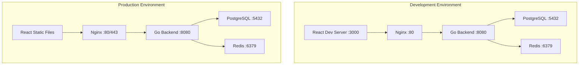

# Docker Implementation Plan

## Overview

This document outlines the detailed Docker implementation strategy for the URL shortening service, including development and production configurations, networking, and deployment considerations.

## Docker Architecture



## Implementation Phases

### Phase 1: Basic Docker Setup

#### 1.1 Project Structure Creation
```
url-shortener/
├── docker-compose.yml
├── docker-compose.prod.yml
├── .env.example
├── .gitignore
├── Makefile
├── frontend/
│   ├── Dockerfile
│   ├── Dockerfile.prod
│   └── package.json
├── backend/
│   ├── Dockerfile
│   ├── Dockerfile.prod
│   └── go.mod
└── docs/
    └── docker.md
```

#### 1.2 Environment Configuration
- Create `.env.example` with all required variables
- Set up development and production environment configurations
- Define database connection strings
- Configure JWT secrets and Redis connections

#### 1.3 Base Dockerfiles
- Multi-stage builds for optimization
- Separate development and production configurations
- Security best practices (non-root users, minimal base images)

### Phase 2: Development Environment

#### 2.1 Development Docker Compose
```yaml
version: '3.8'
services:
  frontend:
    build:
      context: ./frontend
      dockerfile: Dockerfile
    ports:
      - "3000:3000"
    volumes:
      - ./frontend:/app
      - /app/node_modules
    environment:
      - REACT_APP_API_URL=http://localhost:8080
    depends_on:
      - backend

  backend:
    build:
      context: ./backend
      dockerfile: Dockerfile
    ports:
      - "8080:8080"
    volumes:
      - ./backend:/app
    environment:
      - DB_HOST=postgres
      - REDIS_HOST=redis
    depends_on:
      - postgres
      - redis

  postgres:
    image: postgres:15-alpine
    environment:
      - POSTGRES_DB=urlshortener
      - POSTGRES_USER=dev
      - POSTGRES_PASSWORD=devpassword
    ports:
      - "5432:5432"
    volumes:
      - postgres_data:/var/lib/postgresql/data
      - ./backend/migrations:/docker-entrypoint-initdb.d

  redis:
    image: redis:7-alpine
    ports:
      - "6379:6379"
    volumes:
      - redis_data:/data

  nginx:
    image: nginx:alpine
    ports:
      - "80:80"
    volumes:
      - ./nginx/dev.conf:/etc/nginx/nginx.conf
    depends_on:
      - frontend
      - backend

volumes:
  postgres_data:
  redis_data:
```

#### 2.2 Development Dockerfiles

**Frontend Dockerfile (Development)**
```dockerfile
FROM node:18-alpine

WORKDIR /app

COPY package*.json ./
RUN npm ci

COPY . .

EXPOSE 3000

CMD ["npm", "start"]
```

**Backend Dockerfile (Development)**
```dockerfile
FROM golang:1.21-alpine

WORKDIR /app

# Install air for hot reloading
RUN go install github.com/cosmtrek/air@latest

COPY go.mod go.sum ./
RUN go mod download

COPY . .

EXPOSE 8080

CMD ["air", "-c", ".air.toml"]
```

### Phase 3: Production Environment

#### 3.1 Production Docker Compose
```yaml
version: '3.8'
services:
  frontend:
    build:
      context: ./frontend
      dockerfile: Dockerfile.prod
    volumes:
      - frontend_build:/app/build

  backend:
    build:
      context: ./backend
      dockerfile: Dockerfile.prod
    environment:
      - DB_HOST=postgres
      - REDIS_HOST=redis
      - GIN_MODE=release
    depends_on:
      - postgres
      - redis
    restart: unless-stopped

  postgres:
    image: postgres:15-alpine
    environment:
      - POSTGRES_DB=${DB_NAME}
      - POSTGRES_USER=${DB_USER}
      - POSTGRES_PASSWORD=${DB_PASSWORD}
    volumes:
      - postgres_data:/var/lib/postgresql/data
    restart: unless-stopped

  redis:
    image: redis:7-alpine
    volumes:
      - redis_data:/data
    restart: unless-stopped

  nginx:
    image: nginx:alpine
    ports:
      - "80:80"
      - "443:443"
    volumes:
      - ./nginx/prod.conf:/etc/nginx/nginx.conf
      - ./ssl:/etc/nginx/ssl
      - frontend_build:/usr/share/nginx/html
    depends_on:
      - backend
    restart: unless-stopped

volumes:
  postgres_data:
  redis_data:
  frontend_build:
```

#### 3.2 Production Dockerfiles

**Frontend Dockerfile (Production)**
```dockerfile
# Build stage
FROM node:18-alpine as build

WORKDIR /app

COPY package*.json ./
RUN npm ci --only=production

COPY . .
RUN npm run build

# Production stage
FROM nginx:alpine

COPY --from=build /app/build /usr/share/nginx/html

COPY nginx.conf /etc/nginx/conf.d/default.conf

EXPOSE 80

CMD ["nginx", "-g", "daemon off;"]
```

**Backend Dockerfile (Production)**
```dockerfile
# Build stage
FROM golang:1.21-alpine as build

WORKDIR /app

RUN apk add --no-cache git

COPY go.mod go.sum ./
RUN go mod download

COPY . .

RUN CGO_ENABLED=0 GOOS=linux go build -a -installsuffix cgo -o main ./cmd/server

# Production stage
FROM alpine:latest

RUN apk --no-cache add ca-certificates tzdata

WORKDIR /root/

COPY --from=build /app/main .

EXPOSE 8080

CMD ["./main"]
```

### Phase 4: Networking and Security

#### 4.1 Docker Networks
```yaml
networks:
  frontend:
    driver: bridge
  backend:
    driver: bridge
  database:
    driver: bridge
```

#### 4.2 Security Configuration
- Non-root users in containers
- Minimal base images
- Secrets management
- Network segmentation
- Resource limits

#### 4.3 Health Checks
```yaml
healthcheck:
  test: ["CMD", "curl", "-f", "http://localhost:8080/health"]
  interval: 30s
  timeout: 10s
  retries: 3
  start_period: 40s
```

### Phase 5: Optimization and Monitoring

#### 5.1 Image Optimization
- Multi-stage builds
- Layer caching
- Minimal base images
- .dockerignore files

#### 5.2 Performance Tuning
- Resource limits
- Connection pooling
- Cache configuration
- Load balancing

#### 5.3 Monitoring Setup
- Log aggregation
- Metrics collection
- Health monitoring
- Alert configuration

## Implementation Steps

### Step 1: Create Project Structure
1. Create directory structure
2. Initialize Git repository
3. Create .gitignore file
4. Set up Makefile for common commands

### Step 2: Environment Configuration
1. Create .env.example file
2. Define all environment variables
3. Create configuration validation
4. Set up secret management

### Step 3: Development Dockerfiles
1. Create frontend development Dockerfile
2. Create backend development Dockerfile
3. Set up hot reloading for backend
4. Configure volume mounts

### Step 4: Development Docker Compose
1. Create docker-compose.yml
2. Configure service dependencies
3. Set up networking
4. Add health checks

### Step 5: Production Dockerfiles
1. Create optimized frontend Dockerfile
2. Create optimized backend Dockerfile
3. Implement multi-stage builds
4. Add security configurations

### Step 6: Production Docker Compose
1. Create docker-compose.prod.yml
2. Configure production networking
3. Set up persistent volumes
4. Add monitoring and logging

### Step 7: Nginx Configuration
1. Create development Nginx config
2. Create production Nginx config
3. Set up SSL termination
4. Configure reverse proxy

### Step 8: Database Setup
1. Create initialization scripts
2. Set up migration system
3. Configure backup strategy
4. Add monitoring

### Step 9: CI/CD Integration
1. Create GitHub Actions workflow
2. Set up automated testing
3. Configure image registry
4. Implement deployment pipeline

### Step 10: Documentation and Deployment
1. Create deployment guide
2. Add troubleshooting documentation
3. Set up monitoring dashboards
4. Create maintenance procedures

## Configuration Files

### Makefile
```makefile
.PHONY: help dev prod build clean test migrate

help:
	@echo "Available commands:"
	@echo "  dev     - Start development environment"
	@echo "  prod    - Start production environment"
	@echo "  build   - Build all images"
	@echo "  clean   - Clean up containers and images"
	@echo "  test    - Run tests"
	@echo "  migrate - Run database migrations"

dev:
	docker-compose up -d

prod:
	docker-compose -f docker-compose.prod.yml up -d

build:
	docker-compose build
	docker-compose -f docker-compose.prod.yml build

clean:
	docker-compose down -v
	docker-compose -f docker-compose.prod.yml down -v
	docker system prune -f

test:
	docker-compose -f docker-compose.test.yml up --abort-on-container-exit

migrate:
	docker-compose exec backend go run cmd/migrate/main.go up
```

### .dockerignore Examples

**Frontend .dockerignore**
```
node_modules
npm-debug.log
.git
.gitignore
README.md
.env
coverage
.nyc_output
```

**Backend .dockerignore**
```
.git
.gitignore
README.md
.env
*.log
coverage
vendor
.DS_Store
```

## Best Practices

1. **Security**
   - Use non-root users
   - Minimal base images
   - Regular security updates
   - Secrets management

2. **Performance**
   - Multi-stage builds
   - Layer caching
   - Resource limits
   - Health checks

3. **Maintainability**
   - Clear documentation
   - Version tagging
   - Automated testing
   - Monitoring

4. **Scalability**
   - Horizontal scaling support
   - Load balancing
   - Service discovery
   - Auto-scaling

This comprehensive Docker implementation plan provides a roadmap for setting up a robust, secure, and scalable containerized environment for the URL shortening service.