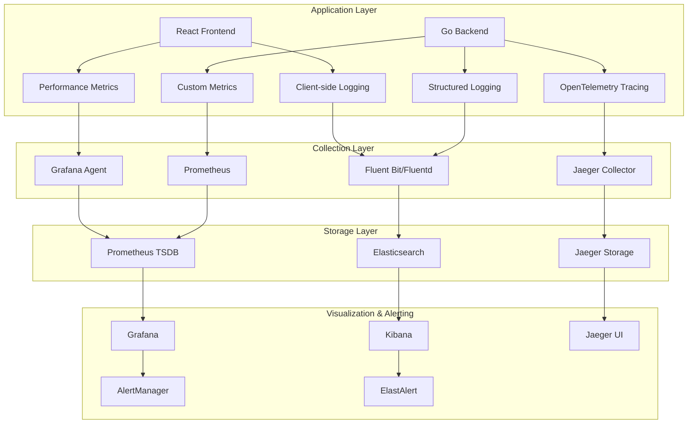

# URL Shortening Service - Monitoring & Observability Deep Dive

## 🔍 **Overview**

This document provides a comprehensive monitoring and observability strategy for the URL shortening service, covering structured logging, metrics collection, distributed tracing, and alerting mechanisms to ensure production reliability and performance visibility.

## 📊 **Observability Stack Architecture**



## 📝 **Structured Logging Strategy**

### **Backend Logging Implementation**

```go
// Logger configuration with structured logging
package logger

import (
    "context"
    "os"
    "time"
    
    "github.com/gin-gonic/gin"
    "github.com/sirupsen/logrus"
    "gopkg.in/natefinch/lumberjack.v2"
)

type Logger struct {
    *logrus.Logger
    service    string
    version    string
    env        string
}

type LogFields struct {
    Service      string                 `json:"service"`
    Version      string                 `json:"version"`
    Environment  string                 `json:"environment"`
    TraceID      string                 `json:"trace_id,omitempty"`
    SpanID       string                 `json:"span_id,omitempty"`
    UserID       string                 `json:"user_id,omitempty"`
    RequestID    string                 `json:"request_id,omitempty"`
    Method       string                 `json:"method,omitempty"`
    Path         string                 `json:"path,omitempty"`
    StatusCode   int                    `json:"status_code,omitempty"`
    Duration     time.Duration          `json:"duration,omitempty"`
    IPAddress    string                 `json:"ip_address,omitempty"`
    UserAgent    string                 `json:"user_agent,omitempty"`
    Error        string                 `json:"error,omitempty"`
    CustomFields map[string]interface{} `json:"custom_fields,omitempty"`
}

func NewLogger(service, version, env string) *Logger {
    log := logrus.New()
    
    // Set JSON formatter for structured logging
    log.SetFormatter(&logrus.JSONFormatter{
        TimestampFormat: time.RFC3339,
        FieldMap: logrus.FieldMap{
            logrus.FieldKeyTime:  "timestamp",
            logrus.FieldKeyLevel: "level",
            logrus.FieldKeyMsg:   "message",
        },
    })
    
    // Set log level based on environment
    switch env {
    case "production":
        log.SetLevel(logrus.InfoLevel)
    case "staging":
        log.SetLevel(logrus.DebugLevel)
    default:
        log.SetLevel(logrus.TraceLevel)
    }
    
    // Configure file rotation for production
    if env == "production" {
        log.SetOutput(&lumberjack.Logger{
            Filename:   "/var/log/url-shortener/app.log",
            MaxSize:    100, // MB
            MaxBackups: 10,
            MaxAge:     30, // days
            Compress:   true,
        })
    }
    
    // Also output to stdout for container environments
    log.SetOutput(os.Stdout)
    
    return &Logger{
        Logger:  log,
        service: service,
        version: version,
        env:     env,
    }
}

func (l *Logger) WithContext(ctx context.Context) *logrus.Entry {
    fields := logrus.Fields{
        "service":     l.service,
        "version":     l.version,
        "environment": l.env,
    }
    
    // Add trace context if available
    if traceID := GetTraceID(ctx); traceID != "" {
        fields["trace_id"] = traceID
    }
    if spanID := GetSpanID(ctx); spanID != "" {
        fields["span_id"] = spanID
    }
    
    // Add request context if available
    if requestID := GetRequestID(ctx); requestID != "" {
        fields["request_id"] = requestID
    }
    if userID := GetUserID(ctx); userID != "" {
        fields["user_id"] = userID
    }
    
    return l.WithFields(fields)
}

func (l *Logger) LogRequest(ctx context.Context, req *gin.Context, duration time.Duration, statusCode int) {
    fields := LogFields{
        Service:     l.service,
        Version:     l.version,
        Environment: l.env,
        Method:      req.Request.Method,
        Path:        req.Request.URL.Path,
        StatusCode:  statusCode,
        Duration:    duration,
        IPAddress:   req.ClientIP(),
        UserAgent:   req.Request.UserAgent(),
    }
    
    // Add trace context
    if traceID := GetTraceID(ctx); traceID != "" {
        fields.TraceID = traceID
    }
    if spanID := GetSpanID(ctx); spanID != "" {
        fields.SpanID = spanID
    }
    
    // Add request ID
    if requestID := GetRequestID(ctx); requestID != "" {
        fields.RequestID = requestID
    }
    
    // Log with appropriate level
    entry := l.WithFields(logrus.Fields(fields))
    
    if statusCode >= 500 {
        entry.Error("Request completed with server error")
    } else if statusCode >= 400 {
        entry.Warn("Request completed with client error")
    } else {
        entry.Info("Request completed successfully")
    }
}

func (l *Logger) LogError(ctx context.Context, err error, msg string, fields map[string]interface{}) {
    logFields := logrus.Fields{
        "service":     l.service,
        "version":     l.version,
        "environment": l.env,
        "error":       err.Error(),
    }
    
    // Add context fields
    if traceID := GetTraceID(ctx); traceID != "" {
        logFields["trace_id"] = traceID
    }
    if spanID := GetSpanID(ctx); spanID != "" {
        logFields["span_id"] = spanID
    }
    if requestID := GetRequestID(ctx); requestID != "" {
        logFields["request_id"] = requestID
    }
    
    // Add custom fields
    for k, v := range fields {
        logFields[k] = v
    }
    
    l.WithFields(logFields).Error(msg)
}

func (l *Logger) LogBusinessEvent(ctx context.Context, eventType string, data map[string]interface{}) {
    fields := logrus.Fields{
        "service":     l.service,
        "version":     l.version,
        "environment": l.env,
        "event_type":  eventType,
    }
    
    // Add context fields
    if traceID := GetTraceID(ctx); traceID != "" {
        fields["trace_id"] = traceID
    }
    if spanID := GetSpanID(ctx); spanID != "" {
        fields["span_id"] = spanID
    }
    if userID := GetUserID(ctx); userID != "" {
        fields["user_id"] = userID
    }
    
    // Add event data
    for k, v := range data {
        fields[k] = v
    }
    
    l.WithFields(fields).Info("Business event")
}
```

### **Frontend Logging Implementation**

```typescript
// Frontend structured logging with contextual information
class Logger {
    private readonly service: string;
    private readonly version: string;
    private readonly environment: string;
    private readonly userId?: string;
    private readonly sessionId: string;

    constructor(config: {
        service: string;
        version: string;
        environment: string;
        userId?: string;
    }) {
        this.service = config.service;
        this.version = config.version;
        this.environment = config.environment;
        this.userId = config.userId;
        this.sessionId = this.generateSessionId();
    }

    private generateSessionId(): string {
        return `session_${Date.now()}_${Math.random().toString(36).substr(2, 9)}`;
    }

    private getBaseFields(): Record<string, any> {
        return {
            service: this.service,
            version: this.version,
            environment: this.environment,
            user_id: this.userId,
            session_id: this.sessionId,
            timestamp: new Date().toISOString(),
            user_agent: navigator.userAgent,
            url: window.location.href,
        };
    }

    private async sendLog(level: string, message: string, fields: Record<string, any> = {}) {
        const logEntry = {
            level,
            message,
            ...this.getBaseFields(),
            ...fields,
        };

        try {
            // Send to logging endpoint
            await fetch('/api/logs', {
                method: 'POST',
                headers: {
                    'Content-Type': 'application/json',
                },
                body: JSON.stringify(logEntry),
            });
        } catch (error) {
            // Fallback to console
            console.error('Failed to send log:', error);
            console.log(`[${level.toUpperCase()}]`, message, logEntry);
        }
    }

    info(message: string, fields: Record<string, any> = {}) {
        this.sendLog('info', message, fields);
    }

    warn(message: string, fields: Record<string, any> = {}) {
        this.sendLog('warn', message, fields);
    }

    error(message: string, error?: Error, fields: Record<string, any> = {}) {
        const errorFields = {
            ...fields,
            ...(error && {
                error_name: error.name,
                error_message: error.message,
                error_stack: error.stack,
            }),
        };
        this.sendLog('error', message, errorFields);
    }

    // Performance logging
    logPerformance(operation: string, duration: number, fields: Record<string, any> = {}) {
        this.sendLog('info', `Performance: ${operation}`, {
            operation,
            duration_ms: duration,
            ...fields,
        });
    }

    // User interaction logging
    logUserInteraction(action: string, element: string, fields: Record<string, any> = {}) {
        this.sendLog('info', `User interaction: ${action}`, {
            action,
            element,
            ...fields,
        });
    }

    // Error boundary logging
    logErrorBoundary(error: Error, errorInfo: React.ErrorInfo) {
        this.sendLog('error', 'React Error Boundary', {
            error_name: error.name,
            error_message: error.message,
            error_stack: error.stack,
            component_stack: errorInfo.componentStack,
        });
    }
}

// React Hook for logging
const useLogger = () => {
    const [logger] = useState(() => new Logger({
        service: 'url-shortener-frontend',
        version: process.env.REACT_APP_VERSION || '1.0.0',
        environment: process.env.NODE_ENV || 'development',
        userId: getCurrentUserId(), // Implement this function
    }));

    return logger;
};

// Performance monitoring hook
const usePerformanceMonitor = (operationName: string) => {
    const logger = useLogger();
    const startTime = useRef<number>();

    const startTiming = useCallback(() => {
        startTime.current = performance.now();
    }, []);

    const endTiming = useCallback((fields: Record<string, any> = {}) => {
        if (startTime.current) {
            const duration = performance.now() - startTime.current;
            logger.logPerformance(operationName, duration, fields);
            startTime.current = undefined;
        }
    }, [logger, operationName]);

    return { startTiming, endTiming };
};
```

## 📈 **Metrics Collection Strategy**

### **Prometheus Metrics Implementation**

```go
// Custom metrics collection
package metrics

import (
    "github.com/prometheus/client_golang/prometheus"
    "github.com/prometheus/client_golang/prometheus/promauto"
    "github.com/prometheus/client_golang/prometheus/promhttp"
    "github.com/gin-gonic/gin"
)

var (
    // HTTP request metrics
    httpRequestsTotal = promauto.NewCounterVec(
        prometheus.CounterOpts{
            Name: "http_requests_total",
            Help: "Total number of HTTP requests",
        },
        []string{"method", "endpoint", "status_code"},
    )

    httpRequestDuration = promauto.NewHistogramVec(
        prometheus.HistogramOpts{
            Name:    "http_request_duration_seconds",
            Help:    "HTTP request duration in seconds",
            Buckets: prometheus.DefBuckets,
        },
        []string{"method", "endpoint"},
    )

    httpRequestSize = promauto.NewHistogramVec(
        prometheus.HistogramOpts{
            Name:    "http_request_size_bytes",
            Help:    "HTTP request size in bytes",
            Buckets: []float64{100, 1000, 10000, 100000, 1000000},
        },
        []string{"method", "endpoint"},
    )

    httpResponseSize = promauto.NewHistogramVec(
        prometheus.HistogramOpts{
            Name:    "http_response_size_bytes",
            Help:    "HTTP response size in bytes",
            Buckets: []float64{100, 1000, 10000, 100000, 1000000},
        },
        []string{"method", "endpoint"},
    )

    // URL shortening metrics
    urlsCreatedTotal = promauto.NewCounterVec(
        prometheus.CounterOpts{
            Name: "urls_created_total",
            Help: "Total number of URLs created",
        },
        []string{"user_type", "has_custom_alias"},
    )

    urlClicksTotal = promauto.NewCounterVec(
        prometheus.CounterOpts{
            Name: "url_clicks_total",
            Help: "Total number of URL clicks",
        },
        []string{"url_id", "country", "device_type"},
    )

    urlShorteningDuration = promauto.NewHistogram(
        prometheus.HistogramOpts{
            Name:    "url_shortening_duration_seconds",
            Help:    "Time taken to shorten a URL",
            Buckets: prometheus.DefBuckets,
        },
    )

    // Database metrics
    dbConnectionsActive = promauto.NewGauge(
        prometheus.GaugeOpts{
            Name: "db_connections_active",
            Help: "Number of active database connections",
        },
    )

    dbQueryDuration = promauto.NewHistogramVec(
        prometheus.HistogramOpts{
            Name:    "db_query_duration_seconds",
            Help:    "Database query duration in seconds",
            Buckets: prometheus.DefBuckets,
        },
        []string{"query_type", "table"},
    )

    // Cache metrics
    cacheHitsTotal = promauto.NewCounterVec(
        prometheus.CounterOpts{
            Name: "cache_hits_total",
            Help: "Total number of cache hits",
        },
        []string{"cache_type", "key_prefix"},
    )

    cacheMissesTotal = promauto.NewCounterVec(
        prometheus.CounterOpts{
            Name: "cache_misses_total",
            Help: "Total number of cache misses",
        },
        []string{"cache_type", "key_prefix"},
    )

    // Background job metrics
    jobsTotal = promauto.NewCounterVec(
        prometheus.CounterOpts{
            Name: "jobs_total",
            Help: "Total number of background jobs",
        },
        []string{"job_type", "status"},
    )

    jobDuration = promauto.NewHistogramVec(
        prometheus.HistogramOpts{
            Name:    "job_duration_seconds",
            Help:    "Background job duration in seconds",
            Buckets: []float64{1, 5, 10, 30, 60, 300, 600, 1800, 3600},
        },
        []string{"job_type"},
    )

    // Business metrics
    activeUsersTotal = promauto.NewGauge(
        prometheus.GaugeOpts{
            Name: "active_users_total",
            Help: "Number of active users",
        },
    )

    urlsTotal = promauto.NewGaugeVec(
        prometheus.GaugeOpts{
            Name: "urls_total",
            Help: "Total number of URLs",
        },
        []string{"status"},
    )
)

// Metrics middleware
func MetricsMiddleware() gin.HandlerFunc {
    return func(c *gin.Context) {
        start := time.Now()
        path := c.Request.URL.Path
        method := c.Request.Method

        // Process request
        c.Next()

        // Record metrics
        status := c.Writer.Status()
        duration := time.Since(start).Seconds()

        httpRequestsTotal.WithLabelValues(method, path, fmt.Sprintf("%d", status)).Inc()
        httpRequestDuration.WithLabelValues(method, path).Observe(duration)

        // Record request/response sizes
        if c.Request.ContentLength > 0 {
            httpRequestSize.WithLabelValues(method, path).Observe(float64(c.Request.ContentLength))
        }
        if c.Writer.Size() > 0 {
            httpResponseSize.WithLabelValues(method, path).Observe(float64(c.Writer.Size()))
        }
    }
}

// Metrics endpoint
func MetricsHandler() gin.HandlerFunc {
    h := promhttp.Handler()
    return func(c *gin.Context) {
        h.ServeHTTP(c.Writer, c.Request)
    }
}

// Custom metric recording functions
func RecordURLCreated(userType, hasCustomAlias string) {
    urlsCreatedTotal.WithLabelValues(userType, hasCustomAlias).Inc()
}

func RecordURLClick(urlID, country, deviceType string) {
    urlClicksTotal.WithLabelValues(urlID, country, deviceType).Inc()
}

func RecordURLShorteningDuration(duration float64) {
    urlShorteningDuration.Observe(duration)
}

func RecordDBQueryDuration(queryType, table string, duration float64) {
    dbQueryDuration.WithLabelValues(queryType, table).Observe(duration)
}

func RecordCacheHit(cacheType, keyPrefix string) {
    cacheHitsTotal.WithLabelValues(cacheType, keyPrefix).Inc()
}

func RecordCacheMiss(cacheType, keyPrefix string) {
    cacheMissesTotal.WithLabelValues(cacheType, keyPrefix).Inc()
}

func RecordJob(jobType, status string) {
    jobsTotal.WithLabelValues(jobType, status).Inc()
}

func RecordJobDuration(jobType string, duration float64) {
    jobDuration.WithLabelValues(jobType).Observe(duration)
}
```

### **Frontend Performance Metrics**

```typescript
// Frontend performance monitoring with Web Vitals
class PerformanceMonitor {
    private logger: Logger;
    private observer?: PerformanceObserver;

    constructor(logger: Logger) {
        this.logger = logger;
        this.setupPerformanceObserver();
    }

    private setupPerformanceObserver() {
        if ('PerformanceObserver' in window) {
            this.observer = new PerformanceObserver((list) => {
                for (const entry of list.getEntries()) {
                    this.processPerformanceEntry(entry);
                }
            });

            // Observe different performance metrics
            this.observer.observe({ entryTypes: ['navigation', 'resource', 'measure', 'paint'] });
            this.observer.observe({ entryTypes: ['largest-contentful-paint'], buffered: true });
            this.observer.observe({ entryTypes: ['first-input'], buffered: true });
            this.observer.observe({ entryTypes: ['layout-shift'], buffered: true });
        }
    }

    private processPerformanceEntry(entry: PerformanceEntry) {
        switch (entry.entryType) {
            case 'navigation':
                this.logNavigationMetrics(entry as PerformanceNavigationTiming);
                break;
            case 'resource':
                this.logResourceMetrics(entry as PerformanceResourceTiming);
                break;
            case 'paint':
                this.logPaintMetrics(entry as PerformancePaintTiming);
                break;
            case 'largest-contentful-paint':
                this.logLCPMetrics(entry as LargestContentfulPaint);
                break;
            case 'first-input':
                this.logFIDMetrics(entry as PerformanceEventTiming);
                break;
            case 'layout-shift':
                this.logCLSMetrics(entry as LayoutShift);
                break;
        }
    }

    private logNavigationMetrics(entry: PerformanceNavigationTiming) {
        const metrics = {
            dns_lookup: entry.domainLookupEnd - entry.domainLookupStart,
            tcp_connect: entry.connectEnd - entry.connectStart,
            ssl_connect: entry.secureConnectionStart > 0 ? entry.connectEnd - entry.secureConnectionStart : 0,
            ttfb: entry.responseStart - entry.requestStart,
            response_download: entry.responseEnd - entry.responseStart,
            dom_parse: entry.domContentLoadedEventStart - entry.responseEnd,
            dom_ready: entry.domContentLoadedEventEnd - entry.domContentLoadedEventStart,
            load_complete: entry.loadEventEnd - entry.loadEventStart,
            page_load: entry.loadEventEnd - entry.navigationStart,
        };

        this.logger.info('Navigation performance', {
            event_type: 'navigation_performance',
            ...metrics,
        });
    }

    private logResourceMetrics(entry: PerformanceResourceTiming) {
        const metrics = {
            name: entry.name,
            type: this.getResourceType(entry.initiatorType),
            duration: entry.duration,
            size: entry.transferSize,
            cached: entry.transferSize === 0 && entry.decodedBodySize > 0,
        };

        this.logger.info('Resource performance', {
            event_type: 'resource_performance',
            ...metrics,
        });
    }

    private logPaintMetrics(entry: PerformancePaintTiming) {
        this.logger.info('Paint performance', {
            event_type: 'paint_performance',
            name: entry.name,
            time: entry.startTime,
        });
    }

    private logLCPMetrics(entry: LargestContentfulPaint) {
        this.logger.info('Largest Contentful Paint', {
            event_type: 'lcp',
            time: entry.startTime,
            size: entry.size,
            url: entry.url,
        });
    }

    private logFIDMetrics(entry: PerformanceEventTiming) {
        this.logger.info('First Input Delay', {
            event_type: 'fid',
            delay: entry.processingStart - entry.startTime,
            input_type: entry.name,
        });
    }

    private logCLSMetrics(entry: LayoutShift) {
        if (!entry.hadRecentInput) {
            this.logger.info('Cumulative Layout Shift', {
                event_type: 'cls',
                value: entry.value,
            });
        }
    }

    private getResourceType(initiatorType: string): string {
        const typeMap: Record<string, string> = {
            'link': 'stylesheet',
            'script': 'javascript',
            'img': 'image',
            'css': 'stylesheet',
            'fetch': 'api',
        };
        return typeMap[initiatorType] || initiatorType;
    }

    // Custom performance measurements
    measure(name: string, startMark: string, endMark?: string) {
        if ('performance' in window && 'measure' in window.performance) {
            try {
                window.performance.measure(name, startMark, endMark);
            } catch (error) {
                this.logger.error('Failed to create performance measure', error as Error, {
                    measure_name: name,
                    start_mark: startMark,
                    end_mark: endMark,
                });
            }
        }
    }

    mark(name: string) {
        if ('performance' in window && 'mark' in window.performance) {
            try {
                window.performance.mark(name);
            } catch (error) {
                this.logger.error('Failed to create performance mark', error as Error, {
                    mark_name: name,
                });
            }
        }
    }

    // API performance monitoring
    async measureAPICall<T>(
        apiCall: () => Promise<T>,
        name: string,
        metadata: Record<string, any> = {}
    ): Promise<T> {
        const startTime = performance.now();
        this.mark(`${name}_start`);

        try {
            const result = await apiCall();
            const endTime = performance.now();
            this.mark(`${name}_end`);
            this.measure(name, `${name}_start`, `${name}_end`);

            this.logger.info('API call performance', {
                event_type: 'api_performance',
                api_name: name,
                duration_ms: endTime - startTime,
                success: true,
                ...metadata,
            });

            return result;
        } catch (error) {
            const endTime = performance.now();
            this.mark(`${name}_error`);
            this.measure(name, `${name}_start`, `${name}_error`);

            this.logger.error('API call failed', error as Error, {
                event_type: 'api_performance',
                api_name: name,
                duration_ms: endTime - startTime,
                success: false,
                ...metadata,
            });

            throw error;
        }
    }
}

// React Hook for performance monitoring
const usePerformanceMonitor = () => {
    const logger = useLogger();
    const [monitor] = useState(() => new PerformanceMonitor(logger));

    return monitor;
};
```

## 🔍 **Distributed Tracing Implementation**

### **OpenTelemetry Tracing Setup**

```go
// OpenTelemetry configuration and tracing
package tracing

import (
    "context"
    "fmt"
    "os"
    
    "go.opentelemetry.io/otel"
    "go.opentelemetry.io/otel/attribute"
    "go.opentelemetry.io/otel/exporters/jaeger"
    "go.opentelemetry.io/otel/propagation"
    "go.opentelemetry.io/otel/sdk/resource"
    "go.opentelemetry.io/otel/sdk/trace"
    semconv "go.opentelemetry.io/otel/semconv/v1.4.0"
    "github.com/gin-gonic/gin"
)

type TracerConfig struct {
    ServiceName    string
    ServiceVersion string
    Environment    string
    JaegerEndpoint string
    SampleRate     float64
}

func InitTracer(config TracerConfig) (*trace.TracerProvider, error) {
    // Create Jaeger exporter
    exp, err := jaeger.New(jaeger.WithCollectorEndpoint(jaeger.WithEndpoint(config.JaegerEndpoint)))
    if err != nil {
        return nil, fmt.Errorf("failed to create Jaeger exporter: %w", err)
    }

    // Create resource
    res, err := resource.New(context.Background(),
        resource.WithAttributes(
            semconv.ServiceNameKey.String(config.ServiceName),
            semconv.ServiceVersionKey.String(config.ServiceVersion),
            attribute.String("environment", config.Environment),
        ),
    )
    if err != nil {
        return nil, fmt.Errorf("failed to create resource: %w", err)
    }

    // Create trace provider
    tp := trace.NewTracerProvider(
        trace.WithBatcher(exp),
        trace.WithResource(res),
        trace.WithSampler(trace.TraceIDRatioBased(config.SampleRate)),
    )

    // Register as global tracer provider
    otel.SetTracerProvider(tp)

    // Set global propagator
    otel.SetTextMapPropagator(propagation.NewCompositeTextMapPropagator(
        propagation.TraceContext{},
        propagation.Baggage{},
    ))

    return tp, nil
}

// Gin middleware for tracing
func TracingMiddleware(serviceName string) gin.HandlerFunc {
    return func(c *gin.Context) {
        tracer := otel.Tracer(serviceName)
        
        // Extract context from incoming headers
        ctx := otel.GetTextMapPropagator().Extract(c.Request.Context(), propagation.HeaderCarrier(c.Request.Header))
        
        // Start span
        spanName := fmt.Sprintf("%s %s", c.Request.Method, c.Request.URL.Path)
        ctx, span := tracer.Start(ctx, spanName)
        defer span.End()

        // Set span attributes
        span.SetAttributes(
            attribute.String("http.method", c.Request.Method),
            attribute.String("http.url", c.Request.URL.String()),
            attribute.String("http.scheme", c.Request.URL.Scheme),
            attribute.String("http.host", c.Request.Host),
            attribute.String("http.user_agent", c.Request.UserAgent()),
            attribute.String("http.remote_addr", c.Request.RemoteAddr),
            attribute.String("http.proto", c.Request.Proto),
        )

        // Add user ID if available
        if userID, exists := c.Get("user_id"); exists {
            span.SetAttributes(attribute.String("user.id", fmt.Sprintf("%v", userID)))
        }

        // Update request context
        c.Request = c.Request.WithContext(ctx)

        // Process request
        c.Next()

        // Set response attributes
        span.SetAttributes(
            attribute.Int("http.status_code", c.Writer.Status()),
            attribute.Int("http.response_size", c.Writer.Size()),
        )

        // Add error if status code indicates error
        if c.Writer.Status() >= 400 {
            span.SetAttributes(attribute.String("error", fmt.Sprintf("HTTP %d", c.Writer.Status())))
        }
    }
}

// Database tracing wrapper
func TraceDatabaseQuery(ctx context.Context, dbType, query, table string, fn func() error) error {
    tracer := otel.Tracer("database")
    
    ctx, span := tracer.Start(ctx, "database.query",
        trace.WithAttributes(
            attribute.String("db.type", dbType),
            attribute.String("db.query", query),
            attribute.String("db.table", table),
        ),
    )
    defer span.End()

    err := fn()
    if err != nil {
        span.SetAttributes(attribute.String("error", err.Error()))
    }

    return err
}

// Cache tracing wrapper
func TraceCacheOperation(ctx context.Context, cacheType, operation, key string, fn func() error) error {
    tracer := otel.Tracer("cache")
    
    ctx, span := tracer.Start(ctx, fmt.Sprintf("cache.%s", operation),
        trace.WithAttributes(
            attribute.String("cache.type", cacheType),
            attribute.String("cache.key", key),
        ),
    )
    defer span.End()

    err := fn()
    if err != nil {
        span.SetAttributes(attribute.String("error", err.Error()))
    } else {
        span.SetAttributes(attribute.String("cache.result", "success"))
    }

    return err
}

// External API tracing wrapper
func TraceExternalAPICall(ctx context.Context, apiName, method, endpoint string, fn func() error) error {
    tracer := otel.Tracer("external_api")
    
    ctx, span := tracer.Start(ctx, fmt.Sprintf("external_api.%s", method),
        trace.WithAttributes(
            attribute.String("api.name", apiName),
            attribute.String("api.method", method),
            attribute.String("api.endpoint", endpoint),
        ),
    )
    defer span.End()

    err := fn()
    if err != nil {
        span.SetAttributes(attribute.String("error", err.Error()))
    }

    return err
}

// Background job tracing
func TraceBackgroundJob(ctx context.Context, jobType, jobID string, fn func() error) error {
    tracer := otel.Tracer("background_job")
    
    ctx, span := tracer.Start(ctx, fmt.Sprintf("job.%s", jobType),
        trace.WithAttributes(
            attribute.String("job.type", jobType),
            attribute.String("job.id", jobID),
        ),
    )
    defer span.End()

    err := fn()
    if err != nil {
        span.SetAttributes(attribute.String("error", err.Error()))
        span.SetAttributes(attribute.String("job.status", "failed"))
    } else {
        span.SetAttributes(attribute.String("job.status", "completed"))
    }

    return err
}
```

## 🚨 **Alerting Strategy**

### **Prometheus Alerting Rules**

```yaml
# alerting_rules.yml
groups:
  - name: url-shortener.rules
    rules:
      # High error rate alert
      - alert: HighErrorRate
        expr: rate(http_requests_total{status_code=~"5.."}[5m]) / rate(http_requests_total[5m]) > 0.05
        for: 2m
        labels:
          severity: critical
          service: url-shortener
        annotations:
          summary: "High error rate detected"
          description: "Error rate is {{ $value | humanizePercentage }} for the last 5 minutes"

      # High latency alert
      - alert: HighLatency
        expr: histogram_quantile(0.95, rate(http_request_duration_seconds_bucket[5m])) > 1
        for: 5m
        labels:
          severity: warning
          service: url-shortener
        annotations:
          summary: "High latency detected"
          description: "95th percentile latency is {{ $value }}s for the last 5 minutes"

      # Database connection alert
      - alert: DatabaseConnectionHigh
        expr: db_connections_active / db_connections_max > 0.8
        for: 5m
        labels:
          severity: warning
          service: url-shortener
        annotations:
          summary: "Database connection usage high"
          description: "Database connection usage is {{ $value | humanizePercentage }}"

      # Cache hit rate alert
      - alert: LowCacheHitRate
        expr: rate(cache_hits_total[5m]) / (rate(cache_hits_total[5m]) + rate(cache_misses_total[5m])) < 0.8
        for: 10m
        labels:
          severity: warning
          service: url-shortener
        annotations:
          summary: "Low cache hit rate"
          description: "Cache hit rate is {{ $value | humanizePercentage }} for the last 5 minutes"

      # Job failure alert
      - alert: JobFailureRate
        expr: rate(jobs_total{status="failed"}[5m]) / rate(jobs_total[5m]) > 0.1
        for: 2m
        labels:
          severity: critical
          service: url-shortener
        annotations:
          summary: "High job failure rate"
          description: "Job failure rate is {{ $value | humanizePercentage }} for the last 5 minutes"

      # URL shortening performance alert
      - alert: URLShorteningSlow
        expr: histogram_quantile(0.95, rate(url_shortening_duration_seconds_bucket[5m])) > 0.5
        for: 5m
        labels:
          severity: warning
          service: url-shortener
        annotations:
          summary: "URL shortening is slow"
          description: "95th percentile URL shortening time is {{ $value }}s"

      # Memory usage alert
      - alert: HighMemoryUsage
        expr: process_resident_memory_bytes / 1024 / 1024 > 500
        for: 5m
        labels:
          severity: warning
          service: url-shortener
        annotations:
          summary: "High memory usage"
          description: "Memory usage is {{ $value }}MB"

      # CPU usage alert
      - alert: HighCPUUsage
        expr: 100 - (avg by(instance) (rate(node_cpu_seconds_total{mode="idle"}[5m])) * 100) > 80
        for: 5m
        labels:
          severity: warning
          service: url-shortener
        annotations:
          summary: "High CPU usage"
          description: "CPU usage is {{ $value }}%"

      # Disk space alert
      - alert: LowDiskSpace
        expr: (node_filesystem_avail_bytes / node_filesystem_size_bytes) * 100 < 10
        for: 5m
        labels:
          severity: critical
          service: url-shortener
        annotations:
          summary: "Low disk space"
          description: "Disk space is {{ $value }}% available"

      # SSL certificate expiry alert
      - alert: SSLCertificateExpiring
        expr: ssl_certificate_expiry_seconds < 7 * 24 * 3600
        for: 1h
        labels:
          severity: warning
          service: url-shortener
        annotations:
          summary: "SSL certificate expiring soon"
          description: "SSL certificate expires in {{ $value | humanizeDuration }}"
```

### **AlertManager Configuration**

```yaml
# alertmanager.yml
global:
  smtp_smarthost: 'localhost:587'
  smtp_from: 'alerts@url-shortener.com'
  smtp_auth_username: 'alerts@url-shortener.com'
  smtp_auth_password: 'password'

route:
  group_by: ['alertname', 'service']
  group_wait: 10s
  group_interval: 10s
  repeat_interval: 1h
  receiver: 'web.hook'
  routes:
    - match:
        severity: critical
      receiver: 'critical-alerts'
    - match:
        severity: warning
      receiver: 'warning-alerts'

receivers:
  - name: 'web.hook'
    webhook_configs:
      - url: 'http://localhost:5001/'

  - name: 'critical-alerts'
    email_configs:
      - to: 'oncall@url-shortener.com'
        subject: '[CRITICAL] {{ .GroupLabels.alertname }}'
        body: |
          {{ range .Alerts }}
          Alert: {{ .Annotations.summary }}
          Description: {{ .Annotations.description }}
          {{ end }}
    slack_configs:
      - api_url: 'https://hooks.slack.com/services/YOUR/SLACK/WEBHOOK'
        channel: '#alerts'
        title: 'Critical Alert: {{ .GroupLabels.alertname }}'
        text: '{{ range .Alerts }}{{ .Annotations.description }}{{ end }}'

  - name: 'warning-alerts'
    email_configs:
      - to: 'dev-team@url-shortener.com'
        subject: '[WARNING] {{ .GroupLabels.alertname }}'
        body: |
          {{ range .Alerts }}
          Alert: {{ .Annotations.summary }}
          Description: {{ .Annotations.description }}
          {{ end }}
    slack_configs:
      - api_url: 'https://hooks.slack.com/services/YOUR/SLACK/WEBHOOK'
        channel: '#warnings'
        title: 'Warning: {{ .GroupLabels.alertname }}'
        text: '{{ range .Alerts }}{{ .Annotations.description }}{{ end }}'

inhibit_rules:
  - source_match:
      severity: 'critical'
  - target_match:
      severity: 'warning'
  - equal: ['alertname', 'service']
```

This comprehensive monitoring and observability strategy provides complete visibility into the URL shortening service's performance, reliability, and user experience, enabling proactive issue detection and resolution.