# URL Shortening Service - Sequence Diagrams

## 1. URL Shortening Use Case

### 1.1 Basic URL Shortening (Anonymous User)

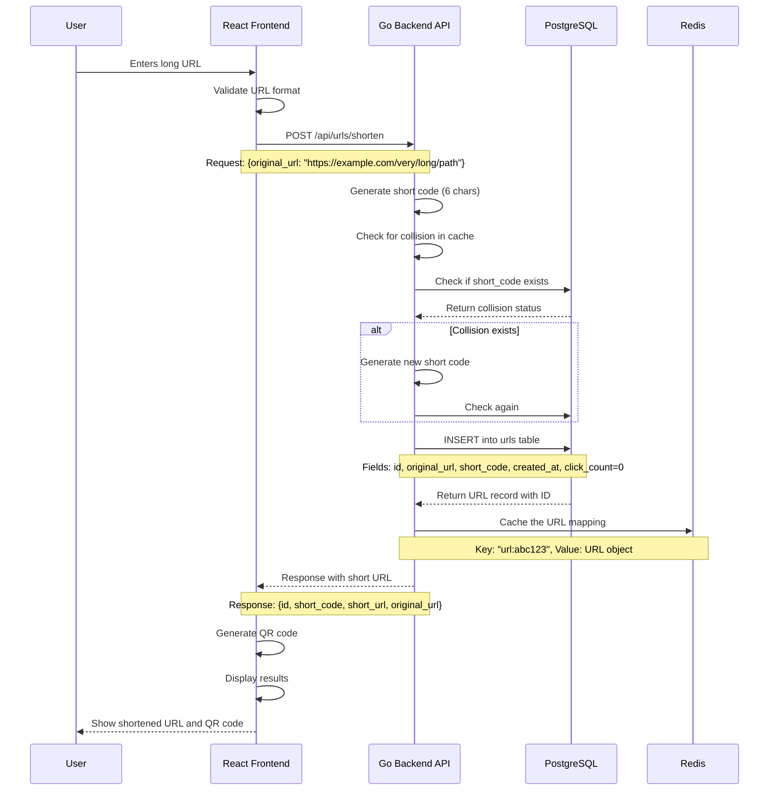

### 1.2 URL Shortening with Custom Alias (Authenticated User)

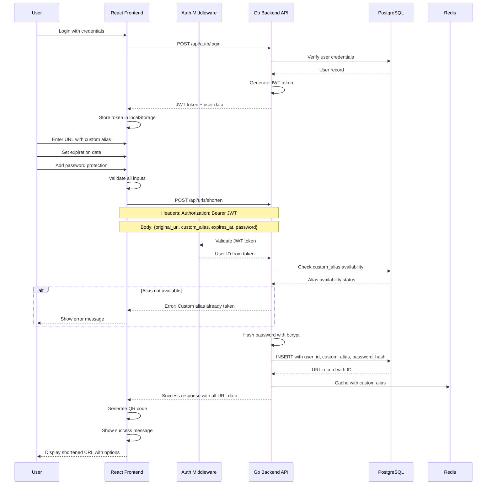

## 2. URL Redirection Use Case

### 2.1 Basic URL Redirection

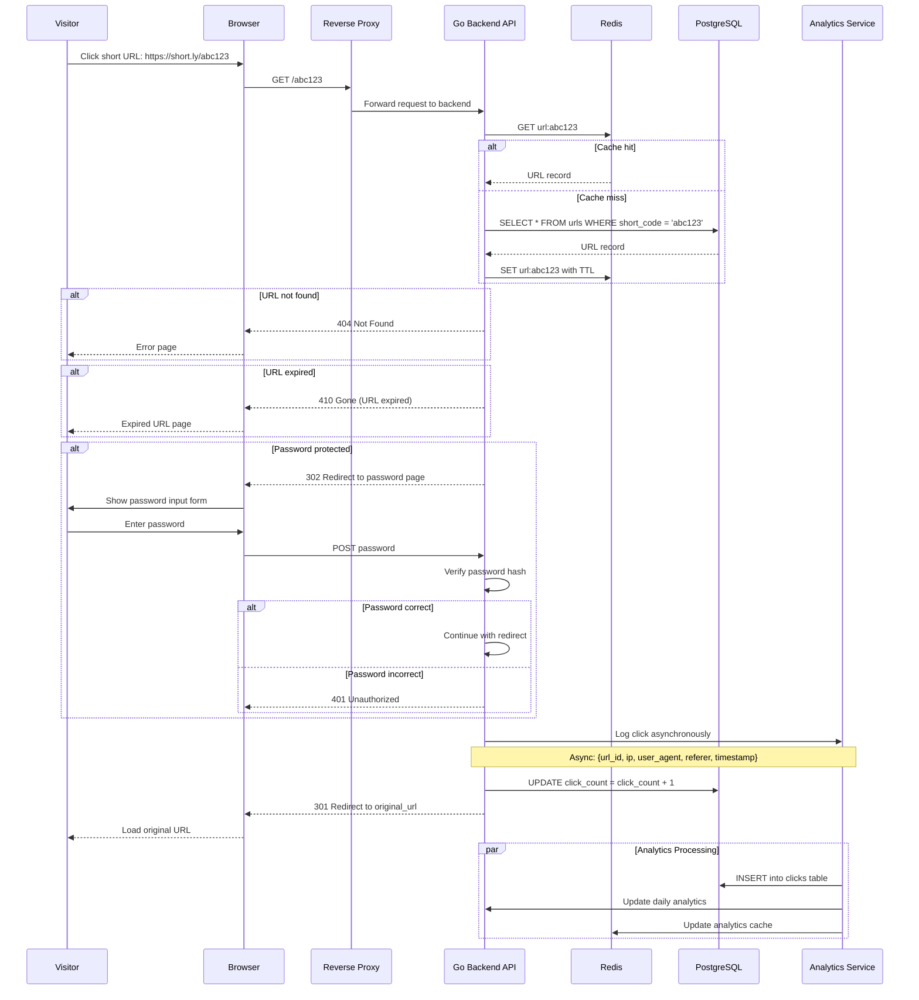

### 2.2 Click Tracking with GeoIP and Device Detection

```mermaid
sequenceDiagram
    participant Visitor
    participant API as Go Backend API
    participant GeoIP as GeoIP Service
    Device as Device Parser
    participant DB as PostgreSQL
    participant Cache as Redis
    
    Visitor->>API: Click short URL
    API->>API: Extract request metadata
    Note over API: IP address, User-Agent, Referer
    
    API->>GeoIP: Lookup IP address
    GeoIP-->>API: Country, City, Coordinates
    
    API->>Device: Parse User-Agent
    Device-->>API: Device type, Browser, OS
    
    API->>Cache: Check if unique visitor
    Note over API,Cache: Key: "unique:url_id:ip_hash"
    
    alt First visit from this IP
        API->>Cache: Mark as unique visitor
        API->>DB: INSERT click with unique=true
    else Returning visitor
        API->>DB: INSERT click with unique=false
    end
    
    API->>DB: Update url_analytics table
    Note over API,DB: Increment daily_clicks, unique_visitors
    Note over API,DB: Update referral_sources, geographic_data, device_data
    
    API->>Cache: Invalidate analytics cache
    Note over API,Cache: DELETE analytics:url_id:*
    
    API-->>Visitor: Redirect to original URL
```

## 3. User Authentication Use Case

### 3.1 User Registration

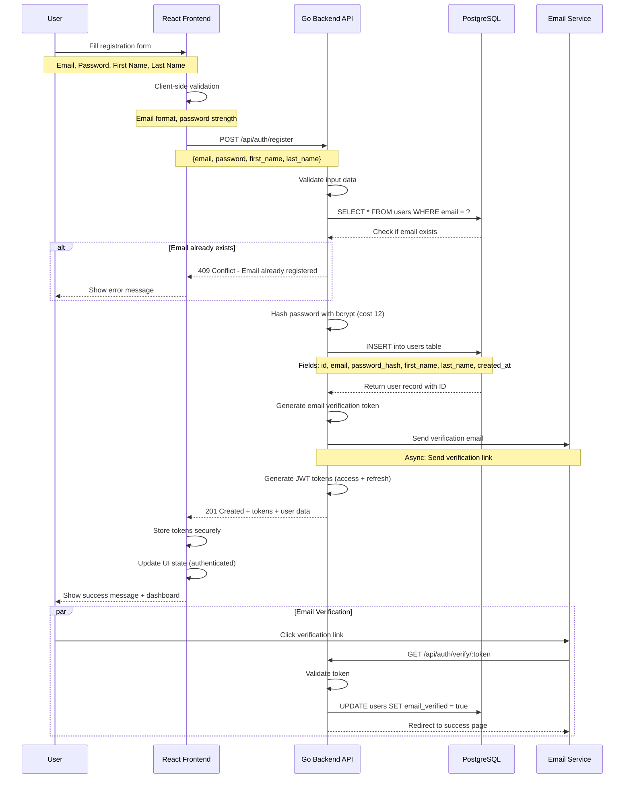

### 3.2 User Login with JWT

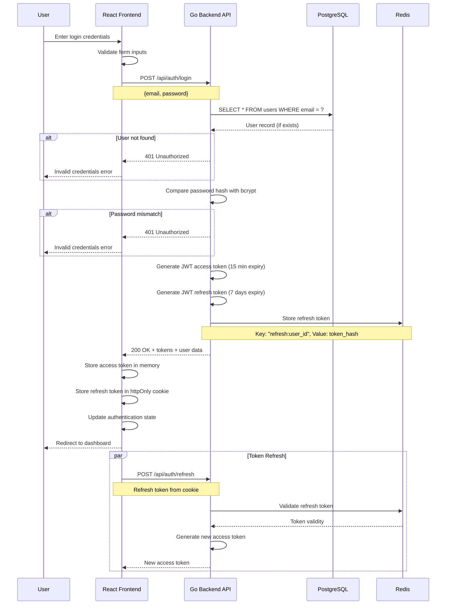

## 4. Analytics Dashboard Use Case

### 4.1 Loading Analytics Dashboard

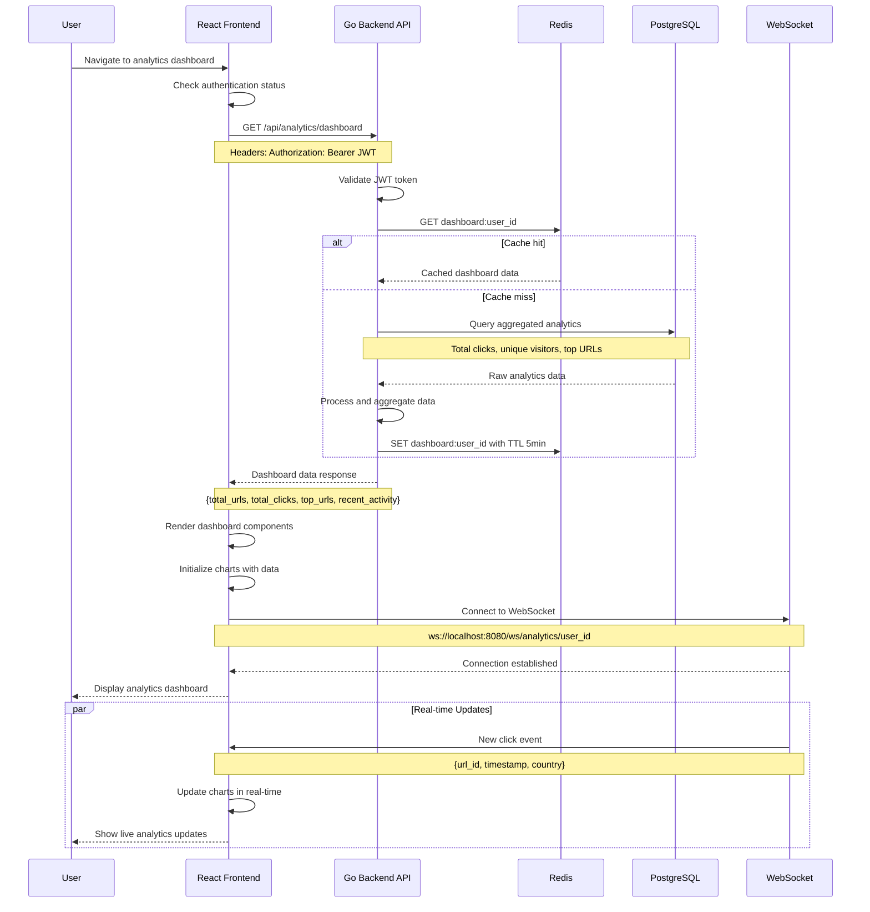

### 4.2 Detailed URL Analytics

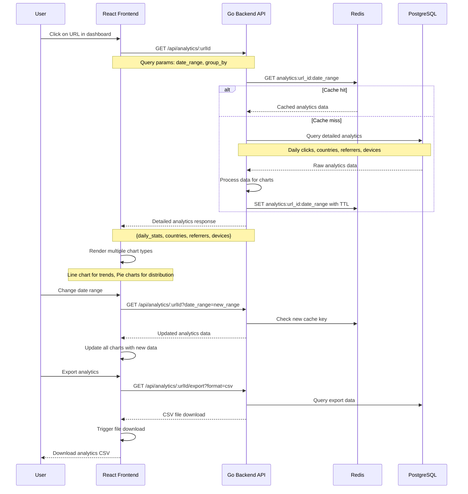

## 5. URL Management Use Case

### 5.1 URL History with Search and Filtering

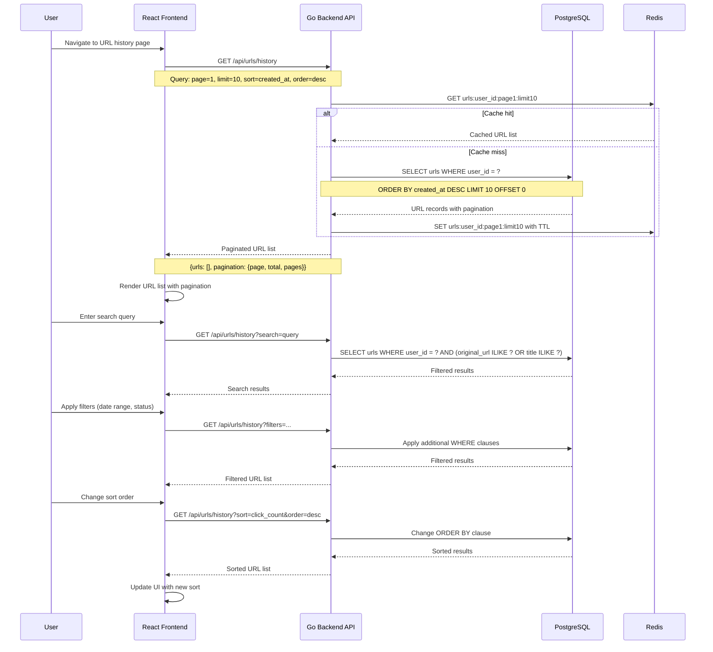

### 5.2 URL Editing and Deletion

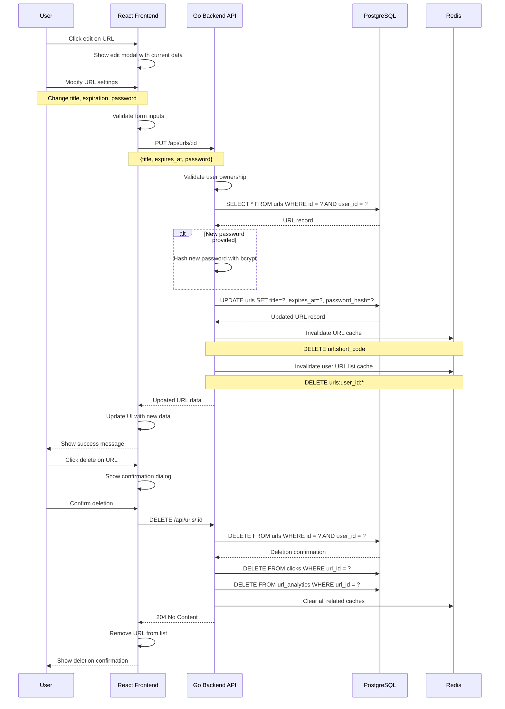

## 6. QR Code Generation Use Case

### 6.1 QR Code Generation and Download

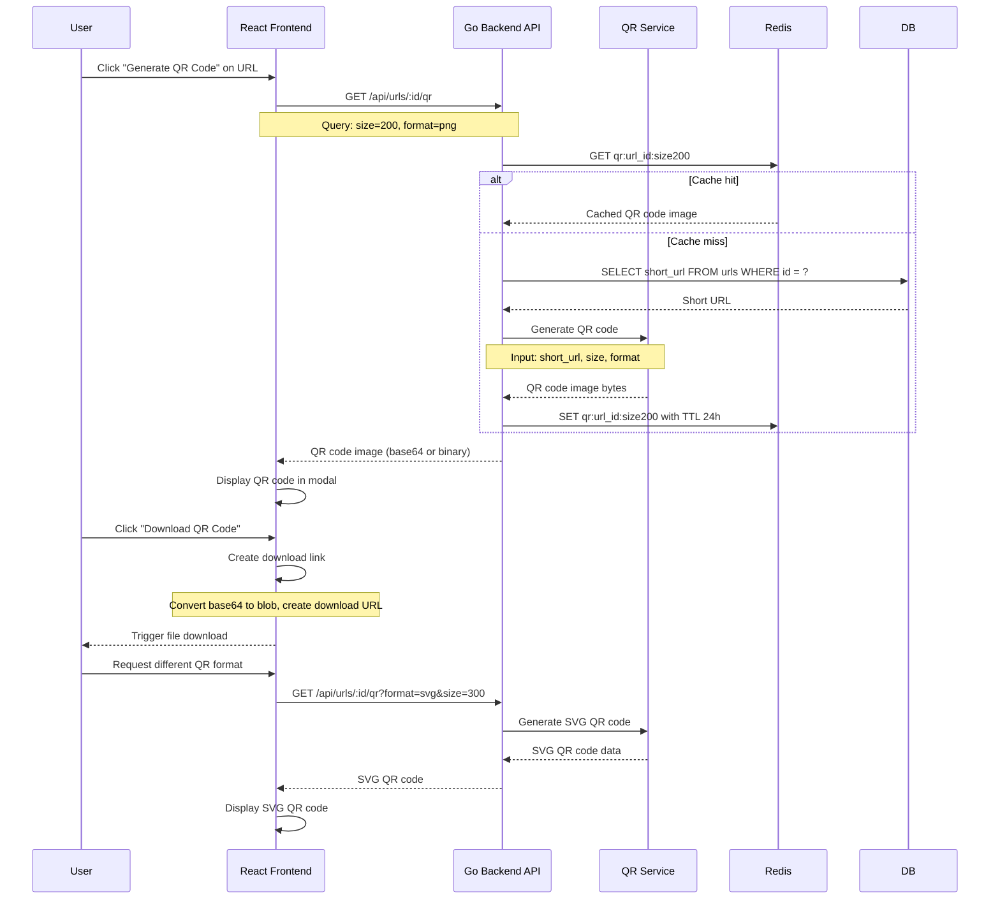

## 7. Real-time Updates Use Case

### 7.1 Live Analytics Updates

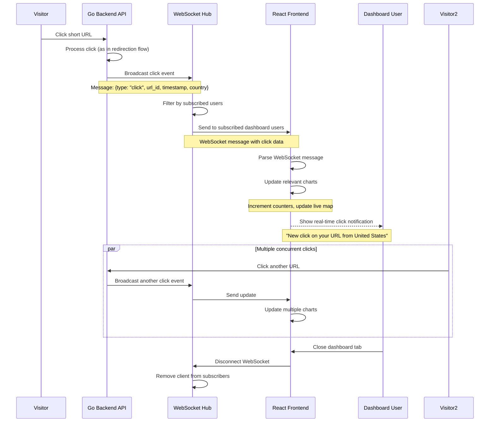

These sequence diagrams provide detailed technical specifications for all major use cases in the URL shortening service, showing the exact flow of data between components, error handling paths, and performance optimizations like caching strategies.