# URL Shortening Service - Sequence Diagrams

## 1. URL Shortening Use Case

### 1.1 Basic URL Shortening (Anonymous User)

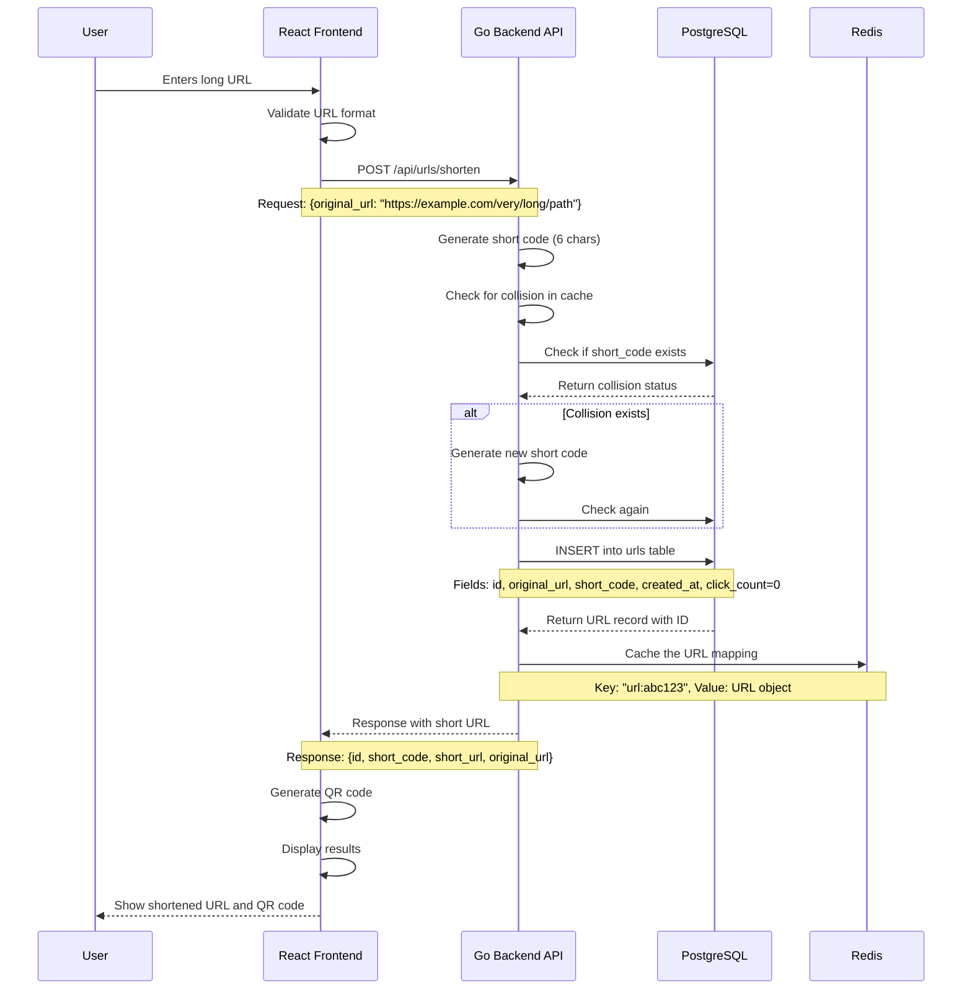
```mermaid
sequenceDiagram
    participant User
    participant Frontend as React Frontend
    participant API as Go Backend API
    participant DB as PostgreSQL
    participant Cache as Redis
    
    User->>Frontend: Enters long URL
    Frontend->>Frontend: Validate URL format
    Frontend->>API: POST /api/urls/shorten
    Note over Frontend,API: Request: {original_url: "https://example.com/very/long/path"}
    
    API->>API: Generate short code (6 chars)
    API->>API: Check for collision in cache
    API->>DB: Check if short_code exists
    DB-->>API: Return collision status
    
    alt Collision exists
        API->>API: Generate new short code
        API->>DB: Check again
    end
    
    API->>DB: INSERT into urls table
    Note over API,DB: Fields: id, original_url, short_code, created_at, click_count=0
    DB-->>API: Return URL record with ID
    
    API->>Cache: Cache the URL mapping
    Note over API,Cache: Key: "url:abc123", Value: URL object
    
    API-->>Frontend: Response with short URL
    Note over API,Frontend: Response: {id, short_code, short_url, original_url}
    
    Frontend->>Frontend: Generate QR code
    Frontend->>Frontend: Display results
    Frontend-->>User: Show shortened URL and QR code
```

### 1.2 URL Shortening with Custom Alias (Authenticated User)

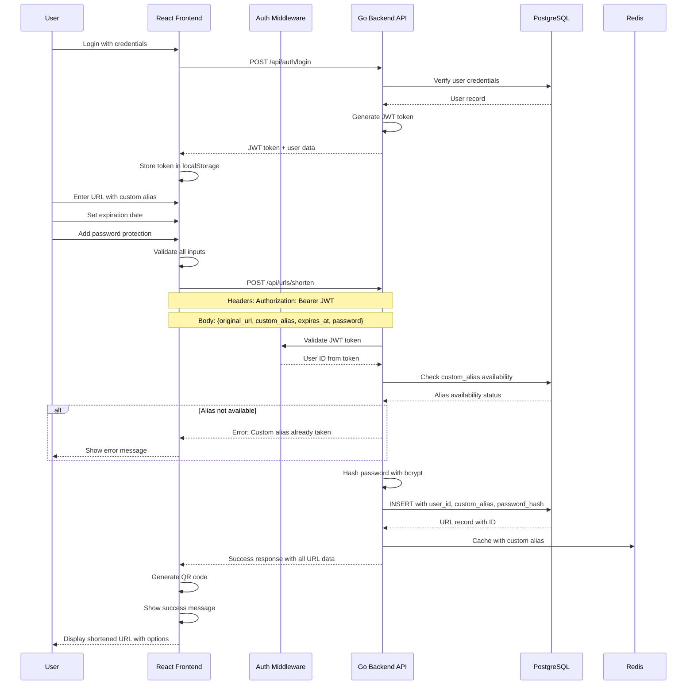
```mermaid
sequenceDiagram
    participant User
    participant Frontend as React Frontend
    participant Auth as Auth Middleware
    participant API as Go Backend API
    participant DB as PostgreSQL
    participant Cache as Redis
    
    User->>Frontend: Login with credentials
    Frontend->>API: POST /api/auth/login
    API->>DB: Verify user credentials
    DB-->>API: User record
    API->>API: Generate JWT token
    API-->>Frontend: JWT token + user data
    Frontend->>Frontend: Store token in localStorage
    
    User->>Frontend: Enter URL with custom alias
    User->>Frontend: Set expiration date
    User->>Frontend: Add password protection
    Frontend->>Frontend: Validate all inputs
    
    Frontend->>API: POST /api/urls/shorten
    Note over Frontend,API: Headers: Authorization: Bearer JWT
    Note over Frontend,API: Body: {original_url, custom_alias, expires_at, password}
    
    API->>Auth: Validate JWT token
    Auth-->>API: User ID from token
    
    API->>DB: Check custom_alias availability
    DB-->>API: Alias availability status
    
    alt Alias not available
        API-->>Frontend: Error: Custom alias already taken
        Frontend-->>User: Show error message
    end
    
    API->>API: Hash password with bcrypt
    API->>DB: INSERT with user_id, custom_alias, password_hash
    DB-->>API: URL record with ID
    
    API->>Cache: Cache with custom alias
    API-->>Frontend: Success response with all URL data
    
    Frontend->>Frontend: Generate QR code
    Frontend->>Frontend: Show success message
    Frontend-->>User: Display shortened URL with options
```

## 2. URL Redirection Use Case

### 2.1 Basic URL Redirection

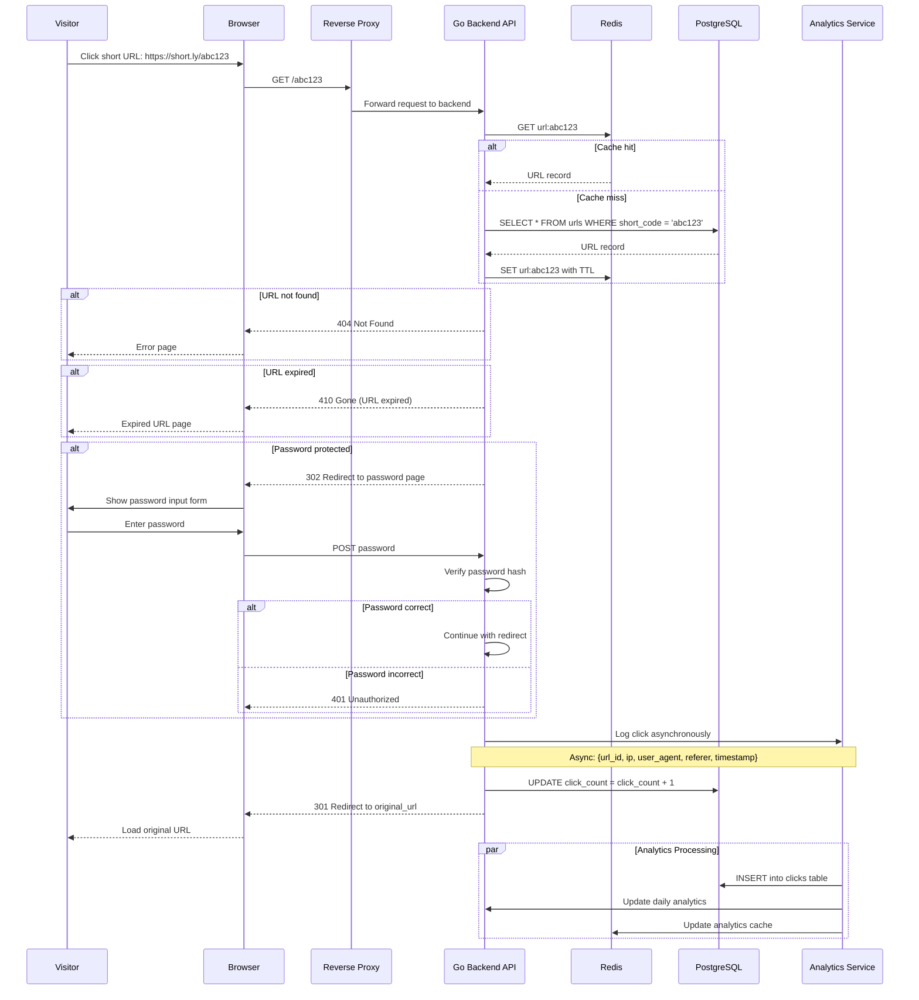
```mermaid
sequenceDiagram
    participant Visitor
    participant Browser
    participant Nginx as Reverse Proxy
    participant API as Go Backend API
    participant Cache as Redis
    participant DB as PostgreSQL
    participant Analytics as Analytics Service
    
    Visitor->>Browser: Click short URL: https://short.ly/abc123
    Browser->>Nginx: GET /abc123
    Nginx->>API: Forward request to backend
    
    API->>Cache: GET url:abc123
    alt Cache hit
        Cache-->>API: URL record
    else Cache miss
        API->>DB: SELECT * FROM urls WHERE short_code = 'abc123'
        DB-->>API: URL record
        API->>Cache: SET url:abc123 with TTL
    end
    
    alt URL not found
        API-->>Browser: 404 Not Found
        Browser-->>Visitor: Error page
    end
    
    alt URL expired
        API-->>Browser: 410 Gone (URL expired)
        Browser-->>Visitor: Expired URL page
    end
    
    alt Password protected
        API-->>Browser: 302 Redirect to password page
        Browser->>Visitor: Show password input form
        Visitor->>Browser: Enter password
        Browser->>API: POST password
        API->>API: Verify password hash
        alt Password correct
            API->>API: Continue with redirect
        else Password incorrect
            API-->>Browser: 401 Unauthorized
        end
    end
    
    API->>Analytics: Log click asynchronously
    Note over API,Analytics: Async: {url_id, ip, user_agent, referer, timestamp}
    
    API->>DB: UPDATE click_count = click_count + 1
    API-->>Browser: 301 Redirect to original_url
    Browser-->>Visitor: Load original URL
    
    par Analytics Processing
        Analytics->>DB: INSERT into clicks table
        Analytics->>API: Update daily analytics
        Analytics->>Cache: Update analytics cache
    end
```

### 2.2 Click Tracking with GeoIP and Device Detection

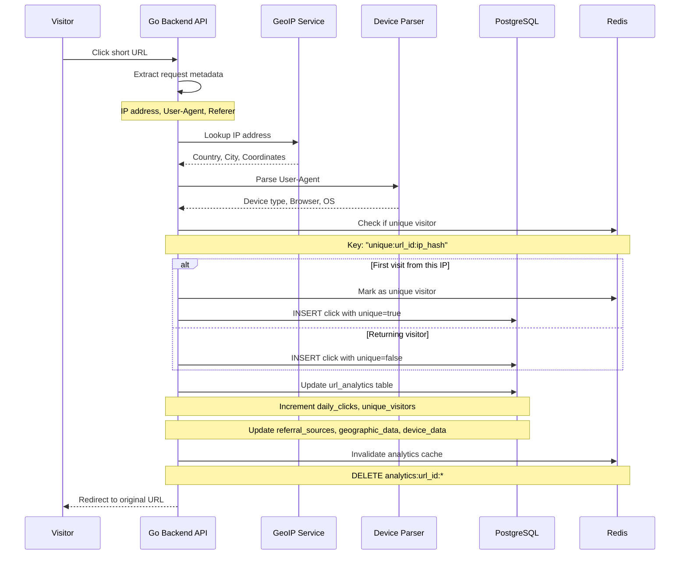
```mermaid
sequenceDiagram
    participant Visitor
    participant API as Go Backend API
    participant GeoIP as GeoIP Service
    participant Device as Device Parser
    participant DB as PostgreSQL
    participant Cache as Redis
    
    Visitor->>API: Click short URL
    API->>API: Extract request metadata
    Note over API: IP address, User-Agent, Referer
    
    API->>GeoIP: Lookup IP address
    GeoIP-->>API: Country, City, Coordinates
    
    API->>Device: Parse User-Agent
    Device-->>API: Device type, Browser, OS
    
    API->>Cache: Check if unique visitor
    Note over API,Cache: Key: "unique:url_id:ip_hash"
    
    alt First visit from this IP
        API->>Cache: Mark as unique visitor
        API->>DB: INSERT click with unique=true
    else Returning visitor
        API->>DB: INSERT click with unique=false
    end
    
    API->>DB: Update url_analytics table
    Note over API,DB: Increment daily_clicks, unique_visitors
    Note over API,DB: Update referral_sources, geographic_data, device_data
    
    API->>Cache: Invalidate analytics cache
    Note over API,Cache: DELETE analytics:url_id:*
    
    API-->>Visitor: Redirect to original URL
```

## 3. User Authentication Use Case

### 3.1 User Registration

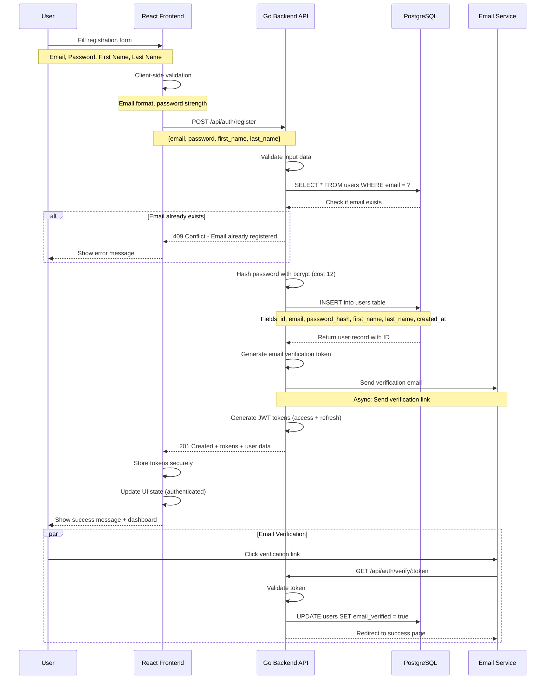
```mermaid
sequenceDiagram
    participant User
    participant Frontend as React Frontend
    participant API as Go Backend API
    participant DB as PostgreSQL
    participant Email as Email Service
    
    User->>Frontend: Fill registration form
    Note over User,Frontend: Email, Password, First Name, Last Name
    Frontend->>Frontend: Client-side validation
    Note over Frontend: Email format, password strength
    
    Frontend->>API: POST /api/auth/register
    Note over Frontend,API: {email, password, first_name, last_name}
    
    API->>API: Validate input data
    API->>DB: SELECT * FROM users WHERE email = ?
    DB-->>API: Check if email exists
    
    alt Email already exists
        API-->>Frontend: 409 Conflict - Email already registered
        Frontend-->>User: Show error message
    end
    
    API->>API: Hash password with bcrypt (cost 12)
    API->>DB: INSERT into users table
    Note over API,DB: Fields: id, email, password_hash, first_name, last_name, created_at
    DB-->>API: Return user record with ID
    
    API->>API: Generate email verification token
    API->>Email: Send verification email
    Note over API,Email: Async: Send verification link
    
    API->>API: Generate JWT tokens (access + refresh)
    API-->>Frontend: 201 Created + tokens + user data
    
    Frontend->>Frontend: Store tokens securely
    Frontend->>Frontend: Update UI state (authenticated)
    Frontend-->>User: Show success message + dashboard
    
    par Email Verification
        User->>Email: Click verification link
        Email->>API: GET /api/auth/verify/:token
        API->>API: Validate token
        API->>DB: UPDATE users SET email_verified = true
        API-->>Email: Redirect to success page
    end
```

### 3.2 User Login with JWT

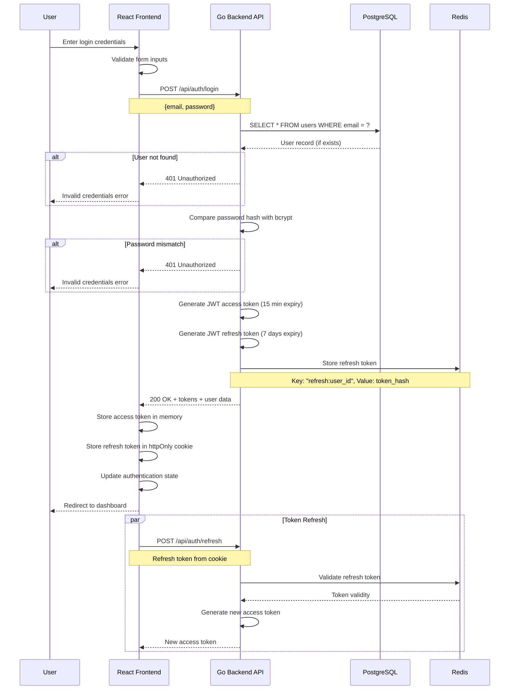
```mermaid
sequenceDiagram
    participant User
    participant Frontend as React Frontend
    participant API as Go Backend API
    participant DB as PostgreSQL
    participant Cache as Redis
    
    User->>Frontend: Enter login credentials
    Frontend->>Frontend: Validate form inputs
    
    Frontend->>API: POST /api/auth/login
    Note over Frontend,API: {email, password}
    
    API->>DB: SELECT * FROM users WHERE email = ?
    DB-->>API: User record (if exists)
    
    alt User not found
        API-->>Frontend: 401 Unauthorized
        Frontend-->>User: Invalid credentials error
    end
    
    API->>API: Compare password hash with bcrypt
    alt Password mismatch
        API-->>Frontend: 401 Unauthorized
        Frontend-->>User: Invalid credentials error
    end
    
    API->>API: Generate JWT access token (15 min expiry)
    API->>API: Generate JWT refresh token (7 days expiry)
    API->>Cache: Store refresh token
    Note over API,Cache: Key: "refresh:user_id", Value: token_hash
    
    API-->>Frontend: 200 OK + tokens + user data
    
    Frontend->>Frontend: Store access token in memory
    Frontend->>Frontend: Store refresh token in httpOnly cookie
    Frontend->>Frontend: Update authentication state
    Frontend-->>User: Redirect to dashboard
    
    par Token Refresh
        Frontend->>API: POST /api/auth/refresh
        Note over Frontend,API: Refresh token from cookie
        API->>Cache: Validate refresh token
        Cache-->>API: Token validity
        API->>API: Generate new access token
        API-->>Frontend: New access token
    end
```

## 4. Analytics Dashboard Use Case

### 4.1 Loading Analytics Dashboard

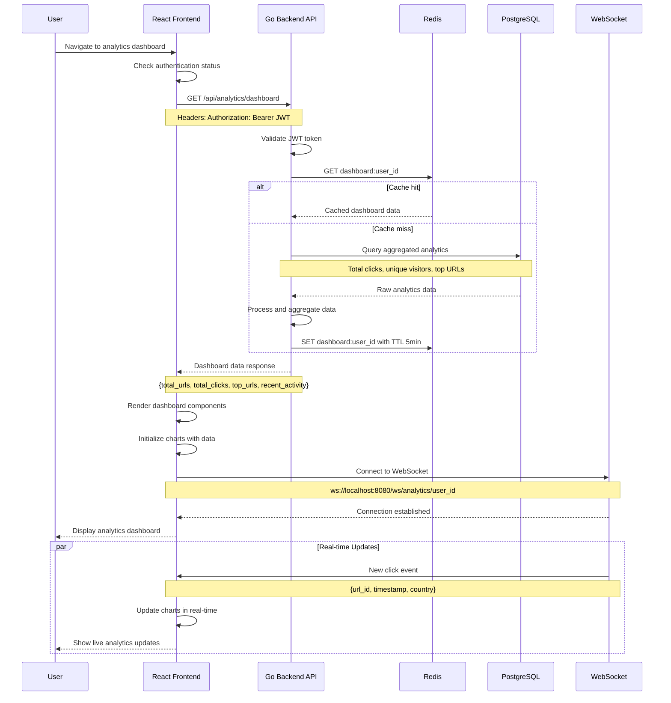
```mermaid
sequenceDiagram
    participant User
    participant Frontend as React Frontend
    participant API as Go Backend API
    participant Cache as Redis
    participant DB as PostgreSQL
    participant WS as WebSocket
    
    User->>Frontend: Navigate to analytics dashboard
    Frontend->>Frontend: Check authentication status
    
    Frontend->>API: GET /api/analytics/dashboard
    Note over Frontend,API: Headers: Authorization: Bearer JWT
    
    API->>API: Validate JWT token
    API->>Cache: GET dashboard:user_id
    alt Cache hit
        Cache-->>API: Cached dashboard data
    else Cache miss
        API->>DB: Query aggregated analytics
        Note over API,DB: Total clicks, unique visitors, top URLs
        DB-->>API: Raw analytics data
        API->>API: Process and aggregate data
        API->>Cache: SET dashboard:user_id with TTL 5min
    end
    
    API-->>Frontend: Dashboard data response
    Note over API,Frontend: {total_urls, total_clicks, top_urls, recent_activity}
    
    Frontend->>Frontend: Render dashboard components
    Frontend->>Frontend: Initialize charts with data
    
    Frontend->>WS: Connect to WebSocket
    Note over Frontend,WS: ws://localhost:8080/ws/analytics/user_id
    WS-->>Frontend: Connection established
    
    Frontend-->>User: Display analytics dashboard
    
    par Real-time Updates
        WS->>Frontend: New click event
        Note over WS,Frontend: {url_id, timestamp, country}
        Frontend->>Frontend: Update charts in real-time
        Frontend-->>User: Show live analytics updates
    end
```

### 4.2 Detailed URL Analytics

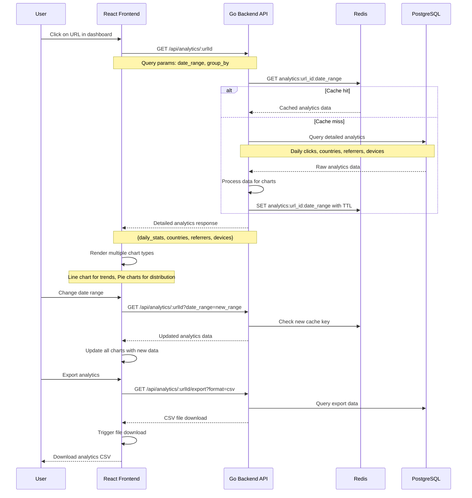
```mermaid
sequenceDiagram
    participant User
    participant Frontend as React Frontend
    participant API as Go Backend API
    participant Cache as Redis
    participant DB as PostgreSQL
    
    User->>Frontend: Click on URL in dashboard
    Frontend->>API: GET /api/analytics/:urlId
    Note over Frontend,API: Query params: date_range, group_by
    
    API->>Cache: GET analytics:url_id:date_range
    alt Cache hit
        Cache-->>API: Cached analytics data
    else Cache miss
        API->>DB: Query detailed analytics
        Note over API,DB: Daily clicks, countries, referrers, devices
        DB-->>API: Raw analytics data
        API->>API: Process data for charts
        API->>Cache: SET analytics:url_id:date_range with TTL
    end
    
    API-->>Frontend: Detailed analytics response
    Note over API,Frontend: {daily_stats, countries, referrers, devices}
    
    Frontend->>Frontend: Render multiple chart types
    Note over Frontend: Line chart for trends, Pie charts for distribution
    
    User->>Frontend: Change date range
    Frontend->>API: GET /api/analytics/:urlId?date_range=new_range
    API->>Cache: Check new cache key
    API-->>Frontend: Updated analytics data
    Frontend->>Frontend: Update all charts with new data
    
    User->>Frontend: Export analytics
    Frontend->>API: GET /api/analytics/:urlId/export?format=csv
    API->>DB: Query export data
    API-->>Frontend: CSV file download
    Frontend->>Frontend: Trigger file download
    Frontend-->>User: Download analytics CSV
```

## 5. URL Management Use Case

### 5.1 URL History with Search and Filtering

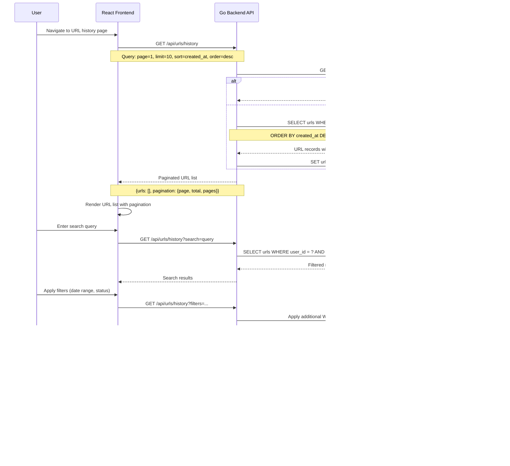
```mermaid
sequenceDiagram
    participant User
    participant Frontend as React Frontend
    participant API as Go Backend API
    participant DB as PostgreSQL
    participant Cache as Redis
    
    User->>Frontend: Navigate to URL history page
    Frontend->>API: GET /api/urls/history
    Note over Frontend,API: Query: page=1, limit=10, sort=created_at, order=desc
    
    API->>Cache: GET urls:user_id:page1:limit10
    alt Cache hit
        Cache-->>API: Cached URL list
    else Cache miss
        API->>DB: SELECT urls WHERE user_id = ?
        Note over API,DB: ORDER BY created_at DESC LIMIT 10 OFFSET 0
        DB-->>API: URL records with pagination
        API->>Cache: SET urls:user_id:page1:limit10 with TTL
    end
    
    API-->>Frontend: Paginated URL list
    Note over API,Frontend: {urls: [], pagination: {page, total, pages}}
    
    Frontend->>Frontend: Render URL list with pagination
    
    User->>Frontend: Enter search query
    Frontend->>API: GET /api/urls/history?search=query
    API->>DB: SELECT urls WHERE user_id = ? AND (original_url ILIKE ? OR title ILIKE ?)
    DB-->>API: Filtered results
    API-->>Frontend: Search results
    
    User->>Frontend: Apply filters (date range, status)
    Frontend->>API: GET /api/urls/history?filters=...
    API->>DB: Apply additional WHERE clauses
    DB-->>API: Filtered results
    API-->>Frontend: Filtered URL list
    
    User->>Frontend: Change sort order
    Frontend->>API: GET /api/urls/history?sort=click_count&order=desc
    API->>DB: Change ORDER BY clause
    DB-->>API: Sorted results
    API-->>Frontend: Sorted URL list
    Frontend->>Frontend: Update UI with new sort
```

### 5.2 URL Editing and Deletion

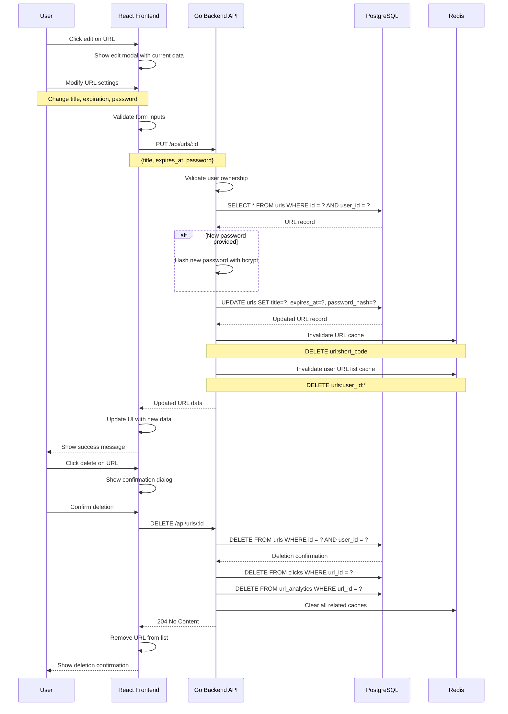
```mermaid
sequenceDiagram
    participant User
    participant Frontend as React Frontend
    participant API as Go Backend API
    participant DB as PostgreSQL
    participant Cache as Redis
    
    User->>Frontend: Click edit on URL
    Frontend->>Frontend: Show edit modal with current data
    
    User->>Frontend: Modify URL settings
    Note over User,Frontend: Change title, expiration, password
    Frontend->>Frontend: Validate form inputs
    
    Frontend->>API: PUT /api/urls/:id
    Note over Frontend,API: {title, expires_at, password}
    
    API->>API: Validate user ownership
    API->>DB: SELECT * FROM urls WHERE id = ? AND user_id = ?
    DB-->>API: URL record
    
    alt New password provided
        API->>API: Hash new password with bcrypt
    end
    
    API->>DB: UPDATE urls SET title=?, expires_at=?, password_hash=?
    DB-->>API: Updated URL record
    
    API->>Cache: Invalidate URL cache
    Note over API,Cache: DELETE url:short_code
    API->>Cache: Invalidate user URL list cache
    Note over API,Cache: DELETE urls:user_id:*
    
    API-->>Frontend: Updated URL data
    Frontend->>Frontend: Update UI with new data
    Frontend-->>User: Show success message
    
    User->>Frontend: Click delete on URL
    Frontend->>Frontend: Show confirmation dialog
    User->>Frontend: Confirm deletion
    
    Frontend->>API: DELETE /api/urls/:id
    API->>DB: DELETE FROM urls WHERE id = ? AND user_id = ?
    DB-->>API: Deletion confirmation
    
    API->>DB: DELETE FROM clicks WHERE url_id = ?
    API->>DB: DELETE FROM url_analytics WHERE url_id = ?
    
    API->>Cache: Clear all related caches
    API-->>Frontend: 204 No Content
    
    Frontend->>Frontend: Remove URL from list
    Frontend-->>User: Show deletion confirmation
```

## 6. QR Code Generation Use Case

### 6.1 QR Code Generation and Download

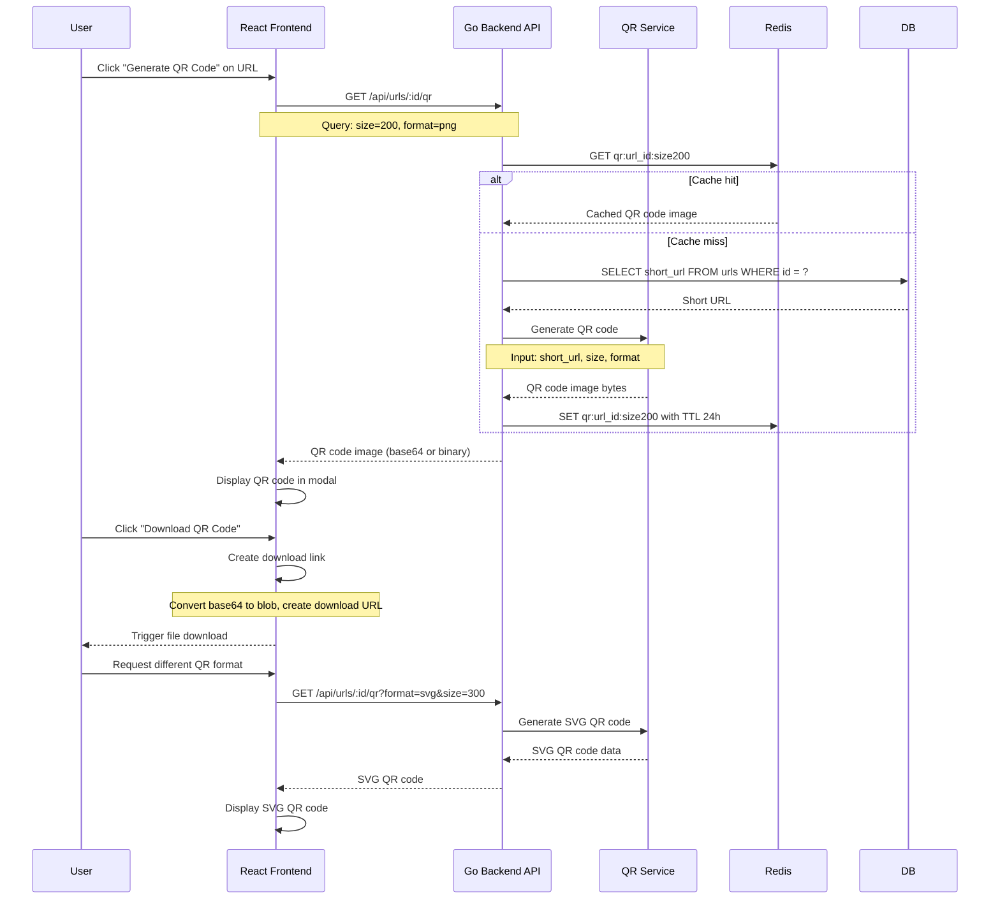
```mermaid
sequenceDiagram
    participant User
    participant Frontend as React Frontend
    participant API as Go Backend API
    participant QR as QR Service
    participant Cache as Redis
    
    User->>Frontend: Click "Generate QR Code" on URL
    Frontend->>API: GET /api/urls/:id/qr
    Note over Frontend,API: Query: size=200, format=png
    
    API->>Cache: GET qr:url_id:size200
    alt Cache hit
        Cache-->>API: Cached QR code image
    else Cache miss
        API->>DB: SELECT short_url FROM urls WHERE id = ?
        DB-->>API: Short URL
        
        API->>QR: Generate QR code
        Note over API,QR: Input: short_url, size, format
        QR-->>API: QR code image bytes
        
        API->>Cache: SET qr:url_id:size200 with TTL 24h
    end
    
    API-->>Frontend: QR code image (base64 or binary)
    Frontend->>Frontend: Display QR code in modal
    
    User->>Frontend: Click "Download QR Code"
    Frontend->>Frontend: Create download link
    Note over Frontend: Convert base64 to blob, create download URL
    
    Frontend-->>User: Trigger file download
    
    User->>Frontend: Request different QR format
    Frontend->>API: GET /api/urls/:id/qr?format=svg&size=300
    API->>QR: Generate SVG QR code
    QR-->>API: SVG QR code data
    API-->>Frontend: SVG QR code
    Frontend->>Frontend: Display SVG QR code
```

## 7. Real-time Updates Use Case

### 7.1 Live Analytics Updates

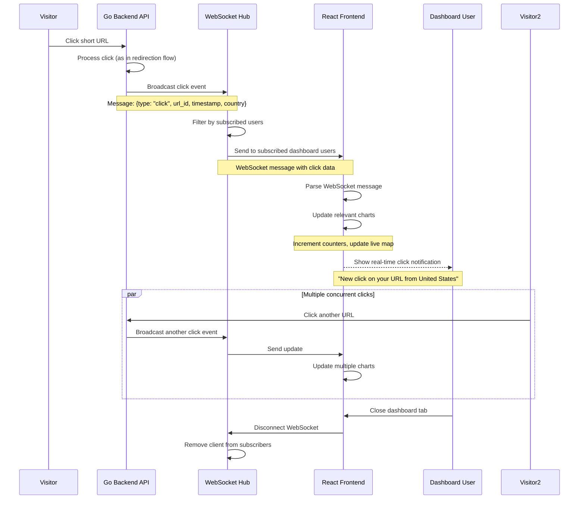
```mermaid
sequenceDiagram
    participant Visitor
    participant API as Go Backend API
    participant WS as WebSocket Hub
    participant Frontend as React Frontend
    participant User as Dashboard User
    
    Visitor->>API: Click short URL
    API->>API: Process click (as in redirection flow)
    
    API->>WS: Broadcast click event
    Note over API,WS: Message: {type: "click", url_id, timestamp, country}
    
    WS->>WS: Filter by subscribed users
    WS->>Frontend: Send to subscribed dashboard users
    Note over WS,Frontend: WebSocket message with click data
    
    Frontend->>Frontend: Parse WebSocket message
    Frontend->>Frontend: Update relevant charts
    Note over Frontend: Increment counters, update live map
    
    Frontend-->>User: Show real-time click notification
    Note over Frontend,User: "New click on your URL from United States"
    
    par Multiple concurrent clicks
        Visitor2->>API: Click another URL
        API->>WS: Broadcast another click event
        WS->>Frontend: Send update
        Frontend->>Frontend: Update multiple charts
    end
    
    User->>Frontend: Close dashboard tab
    Frontend->>WS: Disconnect WebSocket
    WS->>WS: Remove client from subscribers
```

## 8. Password Reset Use Case

### 8.1 Password Reset Flow

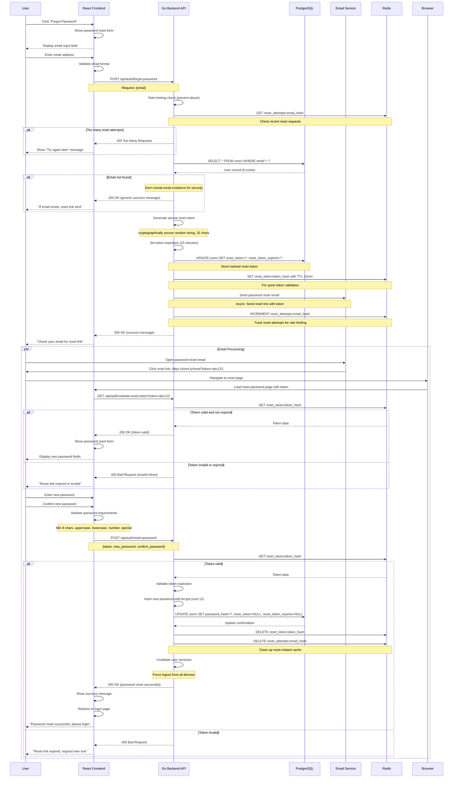
```mermaid
sequenceDiagram
    participant User
    participant Frontend as React Frontend
    participant API as Go Backend API
    participant DB as PostgreSQL
    participant Email as Email Service
    participant Cache as Redis
    
    User->>Frontend: Click "Forgot Password"
    Frontend->>Frontend: Show password reset form
    Frontend-->>User: Display email input field
    
    User->>Frontend: Enter email address
    Frontend->>Frontend: Validate email format
    Frontend->>API: POST /api/auth/forgot-password
    Note over Frontend,API: Request: {email}
    
    API->>API: Rate limiting check (prevent abuse)
    API->>Cache: GET reset_attempts:email_hash
    Note over API,Cache: Check recent reset requests
    
    alt Too many reset attempts
        API-->>Frontend: 429 Too Many Requests
        Frontend-->>User: Show "Try again later" message
    end
    
    API->>DB: SELECT * FROM users WHERE email = ?
    DB-->>API: User record (if exists)
    
    alt Email not found
        Note over API: Don't reveal email existence for security
        API-->>Frontend: 200 OK (generic success message)
        Frontend-->>User: "If email exists, reset link sent"
    end
    
    API->>API: Generate secure reset token
    Note over API: cryptographically secure random string, 32 chars
    API->>API: Set token expiration (15 minutes)
    
    API->>DB: UPDATE users SET reset_token=?, reset_token_expires=?
    Note over API,DB: Store hashed reset token
    
    API->>Cache: SET reset_token:token_hash with TTL 15min
    Note over API,Cache: For quick token validation
    
    API->>Email: Send password reset email
    Note over API,Email: Async: Send reset link with token
    
    API->>Cache: INCREMENT reset_attempts:email_hash
    Note over API,Cache: Track reset attempts for rate limiting
    
    API-->>Frontend: 200 OK (success message)
    Frontend-->>User: "Check your email for reset link"
    
    par Email Processing
        User->>Email: Open password reset email
        Email->>User: Click reset link: https://short.ly/reset?token=abc123
        
        User->>Browser: Navigate to reset page
        Browser->>Frontend: Load reset password page with token
        
        Frontend->>API: GET /api/auth/validate-reset-token?token=abc123
        API->>Cache: GET reset_token:token_hash
        
        alt Token valid and not expired
            Cache-->>API: Token data
            API-->>Frontend: 200 OK (token valid)
            Frontend->>Frontend: Show password reset form
            Frontend-->>User: Display new password fields
        else Token invalid or expired
            API-->>Frontend: 400 Bad Request (invalid token)
            Frontend-->>User: "Reset link expired or invalid"
        end
        
        User->>Frontend: Enter new password
        User->>Frontend: Confirm new password
        Frontend->>Frontend: Validate password requirements
        Note over Frontend: Min 8 chars, uppercase, lowercase, number, special
        
        Frontend->>API: POST /api/auth/reset-password
        Note over Frontend,API: {token, new_password, confirm_password}
        
        API->>Cache: GET reset_token:token_hash
        alt Token valid
            Cache-->>API: Token data
            API->>API: Validate token expiration
            API->>API: Hash new password with bcrypt (cost 12)
            API->>DB: UPDATE users SET password_hash=?, reset_token=NULL, reset_token_expires=NULL
            DB-->>API: Update confirmation
            
            API->>Cache: DELETE reset_token:token_hash
            API->>Cache: DELETE reset_attempts:email_hash
            Note over API,Cache: Clean up reset-related cache
            
            API->>API: Invalidate user sessions
            Note over API: Force logout from all devices
            
            API-->>Frontend: 200 OK (password reset successful)
            Frontend->>Frontend: Show success message
            Frontend->>Frontend: Redirect to login page
            Frontend-->>User: "Password reset successful, please login"
        else Token invalid
            API-->>Frontend: 400 Bad Request
            Frontend-->>User: "Reset link expired, request new one"
        end
    end
```

### 8.2 Password Reset Security Measures

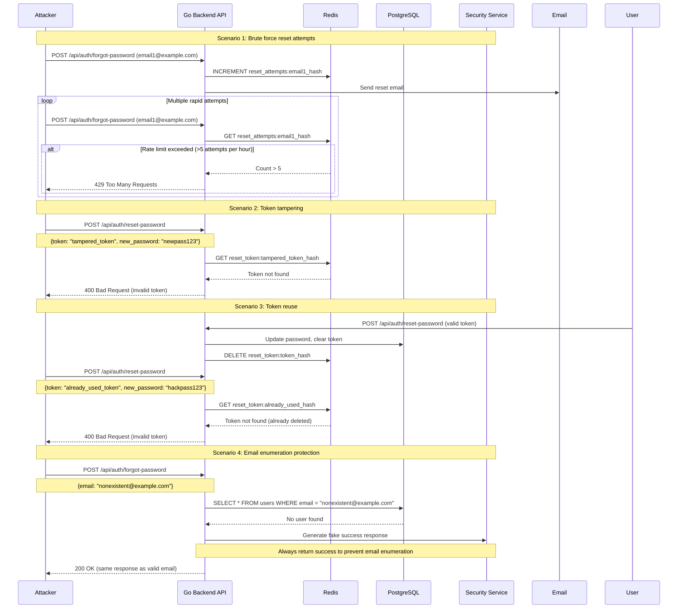
```mermaid
sequenceDiagram
    participant Attacker
    participant API as Go Backend API
    participant Cache as Redis
    participant DB as PostgreSQL
    participant Security as Security Service
    
    Note over Attacker,Security: Scenario 1: Brute force reset attempts
    Attacker->>API: POST /api/auth/forgot-password (email1@example.com)
    API->>Cache: INCREMENT reset_attempts:email1_hash
    API->>Email: Send reset email
    
    loop Multiple rapid attempts
        Attacker->>API: POST /api/auth/forgot-password (email1@example.com)
        API->>Cache: GET reset_attempts:email1_hash
        alt Rate limit exceeded (>5 attempts per hour)
            Cache-->>API: Count > 5
            API-->>Attacker: 429 Too Many Requests
        end
    end
    
    Note over Attacker,Security: Scenario 2: Token tampering
    Attacker->>API: POST /api/auth/reset-password
    Note over Attacker,API: {token: "tampered_token", new_password: "newpass123"}
    
    API->>Cache: GET reset_token:tampered_token_hash
    Cache-->>API: Token not found
    API-->>Attacker: 400 Bad Request (invalid token)
    
    Note over Attacker,Security: Scenario 3: Token reuse
    User->>API: POST /api/auth/reset-password (valid token)
    API->>DB: Update password, clear token
    API->>Cache: DELETE reset_token:token_hash
    
    Attacker->>API: POST /api/auth/reset-password
    Note over Attacker,API: {token: "already_used_token", new_password: "hackpass123"}
    
    API->>Cache: GET reset_token:already_used_hash
    Cache-->>API: Token not found (already deleted)
    API-->>Attacker: 400 Bad Request (invalid token)
    
    Note over Attacker,Security: Scenario 4: Email enumeration protection
    Attacker->>API: POST /api/auth/forgot-password
    Note over Attacker,API: {email: "nonexistent@example.com"}
    
    API->>DB: SELECT * FROM users WHERE email = "nonexistent@example.com"
    DB-->>API: No user found
    
    API->>Security: Generate fake success response
    Note over API,Security: Always return success to prevent email enumeration
    API-->>Attacker: 200 OK (same response as valid email)
```

### 8.3 Password Reset with Account Lockout

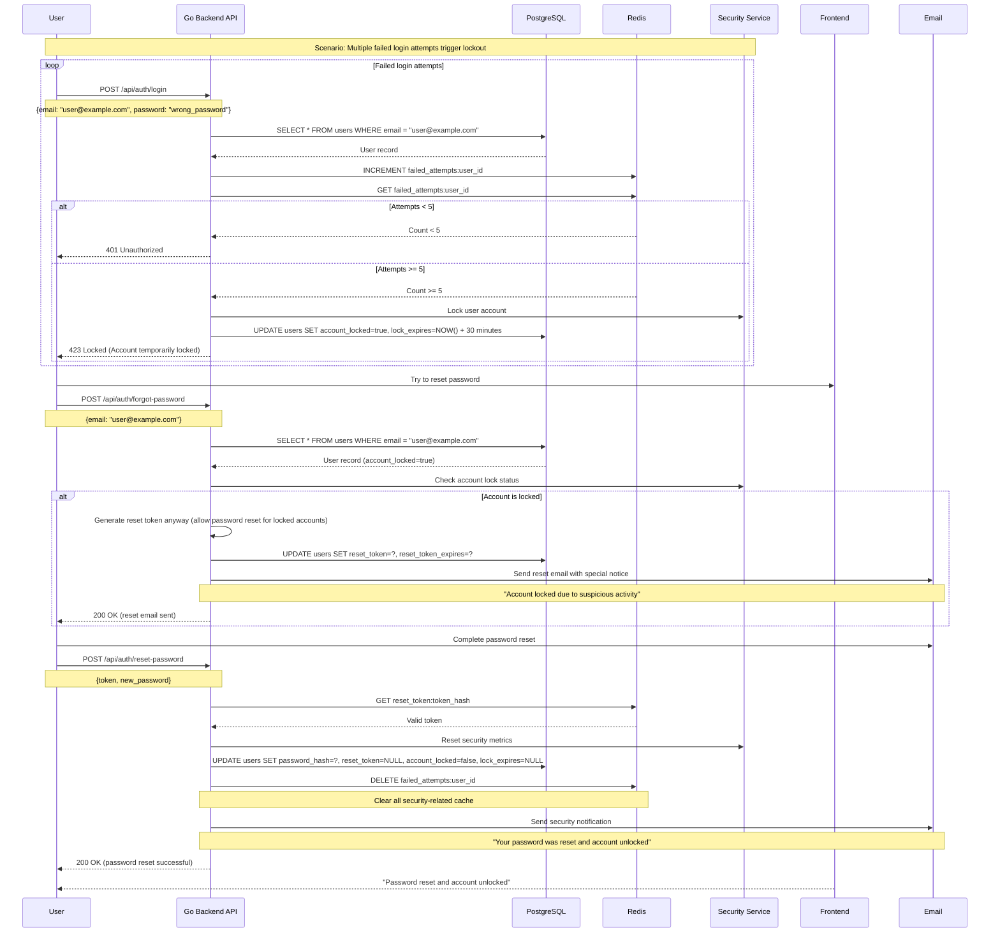
```mermaid
sequenceDiagram
    participant User
    participant API as Go Backend API
    participant DB as PostgreSQL
    participant Cache as Redis
    participant Security as Security Service
    
    Note over User,Security: Scenario: Multiple failed login attempts trigger lockout
    
    loop Failed login attempts
        User->>API: POST /api/auth/login
        Note over User,API: {email: "user@example.com", password: "wrong_password"}
        
        API->>DB: SELECT * FROM users WHERE email = "user@example.com"
        DB-->>API: User record
        
        API->>Cache: INCREMENT failed_attempts:user_id
        API->>Cache: GET failed_attempts:user_id
        
        alt Attempts < 5
            Cache-->>API: Count < 5
            API-->>User: 401 Unauthorized
        else Attempts >= 5
            Cache-->>API: Count >= 5
            API->>Security: Lock user account
            API->>DB: UPDATE users SET account_locked=true, lock_expires=NOW() + 30 minutes
            API-->>User: 423 Locked (Account temporarily locked)
        end
    end
    
    User->>Frontend: Try to reset password
    User->>API: POST /api/auth/forgot-password
    Note over User,API: {email: "user@example.com"}
    
    API->>DB: SELECT * FROM users WHERE email = "user@example.com"
    DB-->>API: User record (account_locked=true)
    
    API->>Security: Check account lock status
    alt Account is locked
        API->>API: Generate reset token anyway (allow password reset for locked accounts)
        API->>DB: UPDATE users SET reset_token=?, reset_token_expires=?
        API->>Email: Send reset email with special notice
        Note over API,Email: "Account locked due to suspicious activity"
        API-->>User: 200 OK (reset email sent)
    end
    
    User->>Email: Complete password reset
    User->>API: POST /api/auth/reset-password
    Note over User,API: {token, new_password}
    
    API->>Cache: GET reset_token:token_hash
    Cache-->>API: Valid token
    
    API->>Security: Reset security metrics
    API->>DB: UPDATE users SET password_hash=?, reset_token=NULL, account_locked=false, lock_expires=NULL
    API->>Cache: DELETE failed_attempts:user_id
    Note over API,Cache: Clear all security-related cache
    
    API->>Email: Send security notification
    Note over API,Email: "Your password was reset and account unlocked"
    
    API-->>User: 200 OK (password reset successful)
    Frontend-->>User: "Password reset and account unlocked"
```

## 9. API Rate Limiting Use Case

### 9.1 Rate Limiting Enforcement

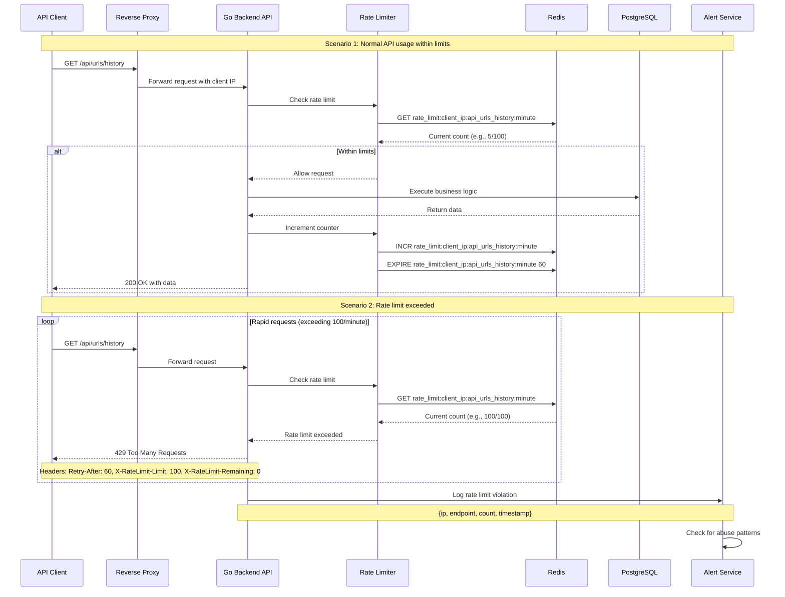
```mermaid
sequenceDiagram
    participant Client as API Client
    participant Nginx as Reverse Proxy
    participant API as Go Backend API
    participant RateLimit as Rate Limiter
    participant Cache as Redis
    participant DB as PostgreSQL
    participant Alert as Alert Service
    
    Note over Client,Alert: Scenario 1: Normal API usage within limits
    Client->>Nginx: GET /api/urls/history
    Nginx->>API: Forward request with client IP
    
    API->>RateLimit: Check rate limit
    RateLimit->>Cache: GET rate_limit:client_ip:api_urls_history:minute
    Cache-->>RateLimit: Current count (e.g., 5/100)
    
    alt Within limits
        RateLimit-->>API: Allow request
        API->>DB: Execute business logic
        DB-->>API: Return data
        API->>RateLimit: Increment counter
        RateLimit->>Cache: INCR rate_limit:client_ip:api_urls_history:minute
        RateLimit->>Cache: EXPIRE rate_limit:client_ip:api_urls_history:minute 60
        API-->>Client: 200 OK with data
    end
    
    Note over Client,Alert: Scenario 2: Rate limit exceeded
    loop Rapid requests (exceeding 100/minute)
        Client->>Nginx: GET /api/urls/history
        Nginx->>API: Forward request
        
        API->>RateLimit: Check rate limit
        RateLimit->>Cache: GET rate_limit:client_ip:api_urls_history:minute
        Cache-->>RateLimit: Current count (e.g., 100/100)
        
        RateLimit-->>API: Rate limit exceeded
        API-->>Client: 429 Too Many Requests
        Note over API,Client: Headers: Retry-After: 60, X-RateLimit-Limit: 100, X-RateLimit-Remaining: 0
    end
    
    API->>Alert: Log rate limit violation
    Note over API,Alert: {ip, endpoint, count, timestamp}
    Alert->>Alert: Check for abuse patterns
```

### 9.2 Multi-Level Rate Limiting

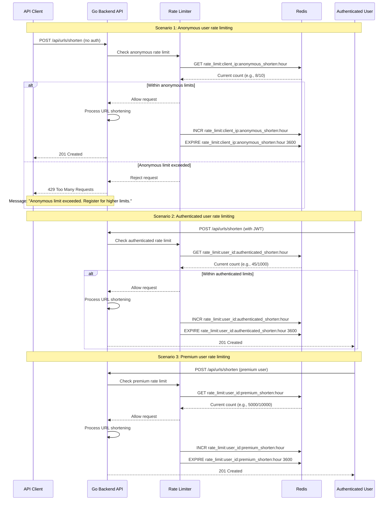
```mermaid
sequenceDiagram
    participant Client as API Client
    participant API as Go Backend API
    participant RateLimit as Rate Limiter
    participant Cache as Redis
    participant User as Authenticated User
    
    Note over Client,User: Scenario 1: Anonymous user rate limiting
    Client->>API: POST /api/urls/shorten (no auth)
    API->>RateLimit: Check anonymous rate limit
    RateLimit->>Cache: GET rate_limit:client_ip:anonymous_shorten:hour
    Cache-->>RateLimit: Current count (e.g., 8/10)
    
    alt Within anonymous limits
        RateLimit-->>API: Allow request
        API->>API: Process URL shortening
        RateLimit->>Cache: INCR rate_limit:client_ip:anonymous_shorten:hour
        RateLimit->>Cache: EXPIRE rate_limit:client_ip:anonymous_shorten:hour 3600
        API-->>Client: 201 Created
    else Anonymous limit exceeded
        RateLimit-->>API: Reject request
        API-->>Client: 429 Too Many Requests
        Note over API,Client: Message: "Anonymous limit exceeded. Register for higher limits."
    end
    
    Note over Client,User: Scenario 2: Authenticated user rate limiting
    User->>API: POST /api/urls/shorten (with JWT)
    API->>RateLimit: Check authenticated rate limit
    RateLimit->>Cache: GET rate_limit:user_id:authenticated_shorten:hour
    Cache-->>RateLimit: Current count (e.g., 45/1000)
    
    alt Within authenticated limits
        RateLimit-->>API: Allow request
        API->>API: Process URL shortening
        RateLimit->>Cache: INCR rate_limit:user_id:authenticated_shorten:hour
        RateLimit->>Cache: EXPIRE rate_limit:user_id:authenticated_shorten:hour 3600
        API-->>User: 201 Created
    end
    
    Note over Client,User: Scenario 3: Premium user rate limiting
    User->>API: POST /api/urls/shorten (premium user)
    API->>RateLimit: Check premium rate limit
    RateLimit->>Cache: GET rate_limit:user_id:premium_shorten:hour
    Cache-->>RateLimit: Current count (e.g., 5000/10000)
    
    RateLimit-->>API: Allow request
    API->>API: Process URL shortening
    RateLimit->>Cache: INCR rate_limit:user_id:premium_shorten:hour
    RateLimit->>Cache: EXPIRE rate_limit:user_id:premium_shorten:hour 3600
    API-->>User: 201 Created
```

### 9.3 Rate Limiting with Sliding Window

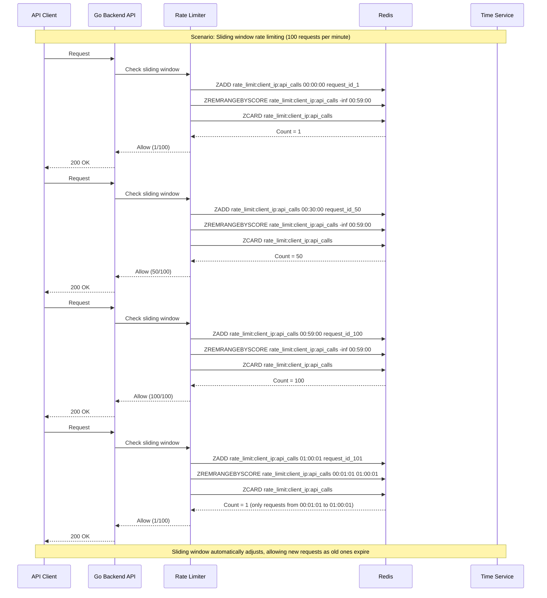
```mermaid
sequenceDiagram
    participant Client as API Client
    participant API as Go Backend API
    participant RateLimit as Rate Limiter
    participant Cache as Redis
    participant Time as Time Service
    
    Note over Client,Time: Scenario: Sliding window rate limiting (100 requests per minute)
    
    Client->>API: Request #1 at 00:00:00
    API->>RateLimit: Check sliding window
    RateLimit->>Cache: ZADD rate_limit:client_ip:api_calls 00:00:00 request_id_1
    RateLimit->>Cache: ZREMRANGEBYSCORE rate_limit:client_ip:api_calls -inf 00:59:00
    RateLimit->>Cache: ZCARD rate_limit:client_ip:api_calls
    Cache-->>RateLimit: Count = 1
    RateLimit-->>API: Allow (1/100)
    API-->>Client: 200 OK
    
    Client->>API: Request #50 at 00:30:00
    API->>RateLimit: Check sliding window
    RateLimit->>Cache: ZADD rate_limit:client_ip:api_calls 00:30:00 request_id_50
    RateLimit->>Cache: ZREMRANGEBYSCORE rate_limit:client_ip:api_calls -inf 00:59:00
    RateLimit->>Cache: ZCARD rate_limit:client_ip:api_calls
    Cache-->>RateLimit: Count = 50
    RateLimit-->>API: Allow (50/100)
    API-->>Client: 200 OK
    
    Client->>API: Request #100 at 00:59:00
    API->>RateLimit: Check sliding window
    RateLimit->>Cache: ZADD rate_limit:client_ip:api_calls 00:59:00 request_id_100
    RateLimit->>Cache: ZREMRANGEBYSCORE rate_limit:client_ip:api_calls -inf 00:59:00
    RateLimit->>Cache: ZCARD rate_limit:client_ip:api_calls
    Cache-->>RateLimit: Count = 100
    RateLimit-->>API: Allow (100/100)
    API-->>Client: 200 OK
    
    Client->>API: Request #101 at 01:00:01
    API->>RateLimit: Check sliding window
    RateLimit->>Cache: ZADD rate_limit:client_ip:api_calls 01:00:01 request_id_101
    RateLimit->>Cache: ZREMRANGEBYSCORE rate_limit:client_ip:api_calls 00:01:01 01:00:01
    RateLimit->>Cache: ZCARD rate_limit:client_ip:api_calls
    Cache-->>RateLimit: Count = 1 (only requests from 00:01:01 to 01:00:01)
    RateLimit-->>API: Allow (1/100)
    API-->>Client: 200 OK
    
    Note over Client,Time: Sliding window automatically adjusts, allowing new requests as old ones expire
```

### 9.4 Distributed Rate Limiting

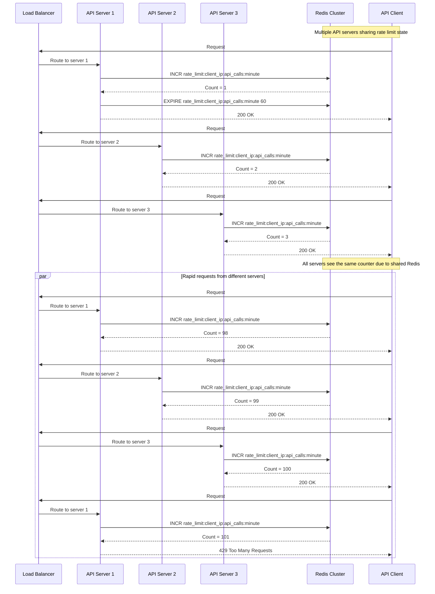
```mermaid
sequenceDiagram
    participant LB as Load Balancer
    participant API1 as API Server 1
    participant API2 as API Server 2
    participant API3 as API Server 3
    participant Cache as Redis Cluster
    participant Client as API Client
    
    Note over Client,Cache: Multiple API servers sharing rate limit state
    
    Client->>LB: Request #1
    LB->>API1: Route to server 1
    API1->>Cache: INCR rate_limit:client_ip:api_calls:minute
    Cache-->>API1: Count = 1
    API1->>Cache: EXPIRE rate_limit:client_ip:api_calls:minute 60
    API1-->>Client: 200 OK
    
    Client->>LB: Request #2
    LB->>API2: Route to server 2
    API2->>Cache: INCR rate_limit:client_ip:api_calls:minute
    Cache-->>API2: Count = 2
    API2-->>Client: 200 OK
    
    Client->>LB: Request #3
    LB->>API3: Route to server 3
    API3->>Cache: INCR rate_limit:client_ip:api_calls:minute
    Cache-->>API3: Count = 3
    API3-->>Client: 200 OK
    
    Note over Client,Cache: All servers see the same counter due to shared Redis
    
    par Rapid requests from different servers
        Client->>LB: Request #98
        LB->>API1: Route to server 1
        API1->>Cache: INCR rate_limit:client_ip:api_calls:minute
        Cache-->>API1: Count = 98
        API1-->>Client: 200 OK
        
        Client->>LB: Request #99
        LB->>API2: Route to server 2
        API2->>Cache: INCR rate_limit:client_ip:api_calls:minute
        Cache-->>API2: Count = 99
        API2-->>Client: 200 OK
        
        Client->>LB: Request #100
        LB->>API3: Route to server 3
        API3->>Cache: INCR rate_limit:client_ip:api_calls:minute
        Cache-->>API3: Count = 100
        API3-->>Client: 200 OK
        
        Client->>LB: Request #101
        LB->>API1: Route to server 1
        API1->>Cache: INCR rate_limit:client_ip:api_calls:minute
        Cache-->>API1: Count = 101
        API1-->>Client: 429 Too Many Requests
    end
```

### 9.5 Rate Limiting Bypass Detection

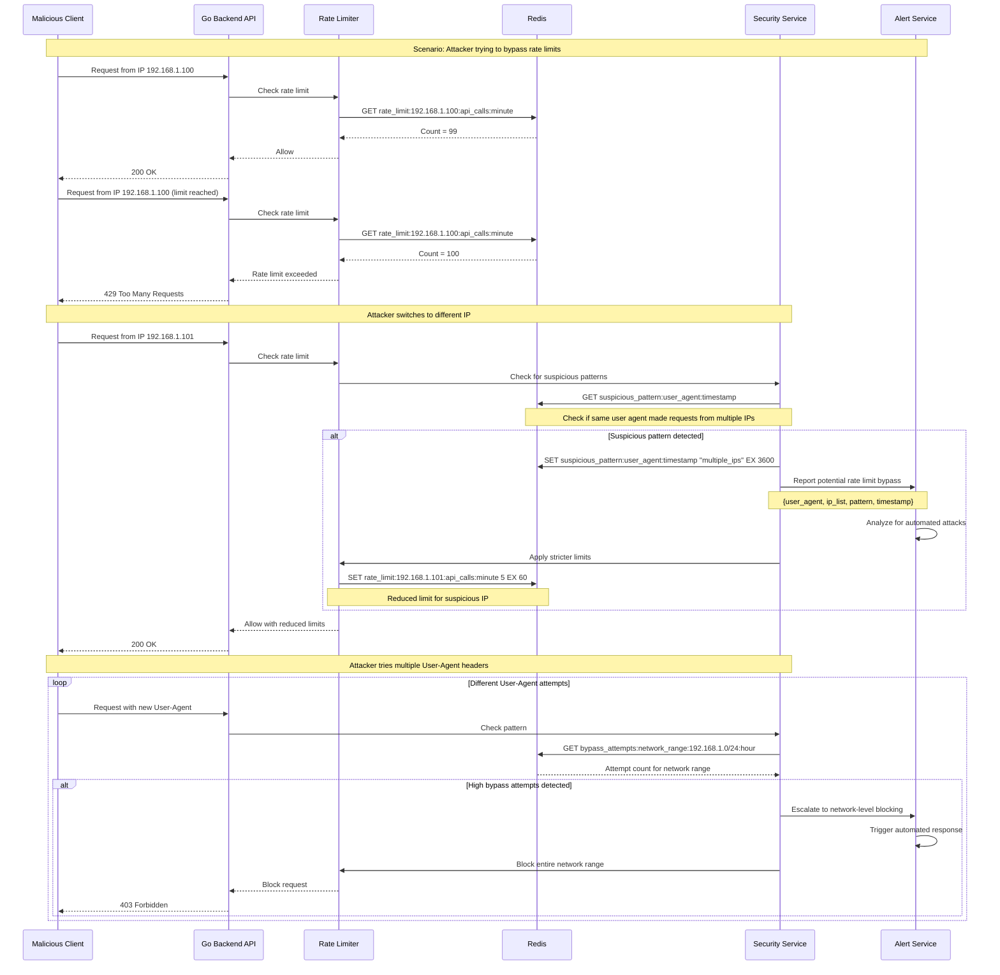
```mermaid
sequenceDiagram
    participant Attacker as Malicious Client
    participant API as Go Backend API
    participant RateLimit as Rate Limiter
    participant Cache as Redis
    participant Security as Security Service
    participant Alert as Alert Service
    
    Note over Attacker,Alert: Scenario: Attacker trying to bypass rate limits
    
    Attacker->>API: Request from IP 192.168.1.100
    API->>RateLimit: Check rate limit
    RateLimit->>Cache: GET rate_limit:192.168.1.100:api_calls:minute
    Cache-->>RateLimit: Count = 99
    RateLimit-->>API: Allow
    API-->>Attacker: 200 OK
    
    Attacker->>API: Request from IP 192.168.1.100 (limit reached)
    API->>RateLimit: Check rate limit
    RateLimit->>Cache: GET rate_limit:192.168.1.100:api_calls:minute
    Cache-->>RateLimit: Count = 100
    RateLimit-->>API: Rate limit exceeded
    API-->>Attacker: 429 Too Many Requests
    
    Note over Attacker,Security: Attacker switches to different IP
    Attacker->>API: Request from IP 192.168.1.101
    API->>RateLimit: Check rate limit
    RateLimit->>Security: Check for suspicious patterns
    
    Security->>Cache: GET suspicious_pattern:user_agent:timestamp
    Note over Security,Cache: Check if same user agent made requests from multiple IPs
    
    alt Suspicious pattern detected
        Security->>Cache: SET suspicious_pattern:user_agent:timestamp "multiple_ips" EX 3600
        Security->>Alert: Report potential rate limit bypass
        Note over Security,Alert: {user_agent, ip_list, pattern, timestamp}
        Alert->>Alert: Analyze for automated attacks
        
        Security->>RateLimit: Apply stricter limits
        RateLimit->>Cache: SET rate_limit:192.168.1.101:api_calls:minute 5 EX 60
        Note over RateLimit,Cache: Reduced limit for suspicious IP
    end
    
    RateLimit-->>API: Allow with reduced limits
    API-->>Attacker: 200 OK
    
    Note over Attacker,Security: Attacker tries multiple User-Agent headers
    loop Different User-Agent attempts
        Attacker->>API: Request with new User-Agent
        API->>Security: Check pattern
        Security->>Cache: GET bypass_attempts:network_range:192.168.1.0/24:hour
        Cache-->>Security: Attempt count for network range
        
        alt High bypass attempts detected
            Security->>Alert: Escalate to network-level blocking
            Alert->>Alert: Trigger automated response
            Security->>RateLimit: Block entire network range
            RateLimit-->>API: Block request
            API-->>Attacker: 403 Forbidden
        end
    end
```

These sequence diagrams provide detailed technical specifications for all major use cases in the URL shortening service, showing the exact flow of data between components, error handling paths, comprehensive security measures, and performance optimizations like caching strategies and distributed rate limiting.